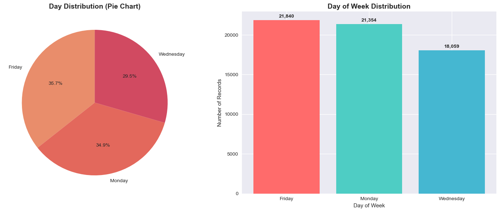
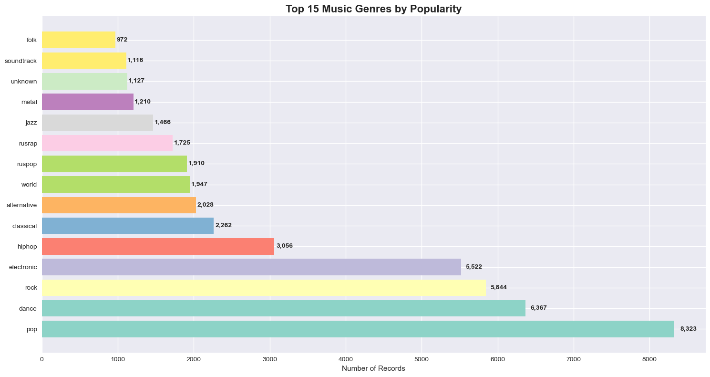
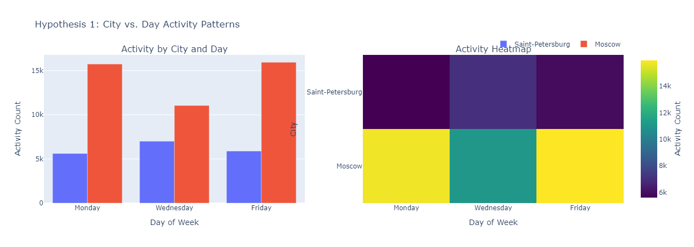

# Music of Big Cities: Moscow vs. Saint Petersburg
## Business Intelligence Report

**Author:** Arina Fedorova  
**Data Source:** Yandex Music Platform  
**Analysis Period:** Historical Data  

---

## Executive Summary

This analysis examines user behavior patterns on Yandex Music platform across Russia's two largest cities: Moscow and Saint Petersburg. The study investigates how cultural differences, urban lifestyles, and weekly rhythms influence musical preferences and listening habits.

### Key Findings
- **Urban Rhythm Impact**: Moscow shows stronger workweek patterns with Friday-Monday peaks, while Saint Petersburg maintains more consistent midweek activity
- **Cultural Distinction**: Saint Petersburg demonstrates slightly higher classical and alternative genre preferences, fitting its cultural capital reputation
- **Temporal Patterns**: Minimal variation in genre preferences by day across both cities, suggesting consistent musical tastes regardless of timing

### Business Implications
- **Moscow**: Focus on Monday/Friday campaigns, emphasize workweek rhythm and weekend transitions
- **Saint Petersburg**: Consistent messaging throughout the week, highlight cultural diversity and local artistic heritage
- **Genre Targeting**: Pop music dominates both cities, but classical/alternative shows stronger appeal in Saint Petersburg

---

## Introduction

### Project Overview
In the rhythm of urban life, where Monday mornings carry the weight of workweek beginnings and Friday evenings promise weekend liberation, music serves as both soundtrack and cultural fingerprint. This analysis examines how Moscow and Saint Petersburg, two cities separated by geography but united by their status as Russia's cultural capitals, express their distinct personalities through the music their residents choose to hear.

The data comes from Yandex Music, a platform that records the listening habits of thousands of users across these cities. What emerges is not just a collection of numbers, but a portrait of urban character written in the language of musical preference.

### Research Questions
Three questions guide this investigation:
1. How does the day of the week shape listening patterns in each city?
2. Do musical tastes shift with the clock, revealing temporal personality traits?
3. What distinguishes the musical soul of Moscow from that of Saint Petersburg?

### Methodology
The analysis employs comprehensive data quality assessment, exploratory data analysis, and statistical hypothesis testing using chi-square tests. The dataset contains 65,079 records of music streaming activity, processed to 61,253 clean records for analysis.

---

## Data Overview

### Dataset Characteristics
- **Total Records**: 65,079 original, 61,253 after cleaning
- **Cities Analyzed**: Moscow (69.8%) and Saint Petersburg (30.2%)
- **Time Coverage**: Monday, Wednesday, Friday
- **Genres Identified**: 287 unique musical categories
- **Data Quality**: 11.1% improvement through systematic preprocessing

### Data Quality Assessment
- **Missing Values**: Artist names (11.1%), Track names (1.9%), Genres (1.8%)
- **Duplicates**: 3,826 records (5.9%) removed during preprocessing
- **Memory Optimization**: Reduced from 25.58 MB to 14.68 MB

---

## Key Findings

### 1. Urban Activity Patterns

#### City Distribution

*Figure 1: Distribution of music streaming activity between Moscow and Saint Petersburg*

The data reveals a clear geographic concentration in Russia's music streaming patterns:
- **Moscow dominates** with 42,741 records (69.8%) of the total dataset
- **Saint Petersburg** represents 18,512 records (30.2%)

This 2.3:1 ratio suggests Moscow's overwhelming influence on the Russian music market. Given Moscow's status as the capital and largest city, this distribution makes sense - it's the cultural and economic center where most music consumption happens.

#### Weekly Activity Patterns

*Figure 2: Weekly activity patterns

The data reveals a clear weekly rhythm in Russian music streaming behavior:
- **Friday leads** with 21,840 records (35.7%) - the weekend gateway effect
- **Monday follows** with 21,354 records (34.9%) - fresh week energy
- **Wednesday lags** at 18,059 records (29.5%) - the midweek slump

This Friday-Monday dominance suggests music consumption follows the workweek emotional arc. Friday represents the release valve - people streaming more as they transition from work to weekend. Monday shows the reset button - fresh starts often accompanied by motivational or familiar music.

### 2. Musical Genre Preferences

#### Overall Genre Rankings

*Figure 3: Three-tier hierarchy of music genres showing pop (13.6%), dance (10.4%), rock (9.5%), and electronic (9.0%) as top genres*

The data reveals a clear three-tier hierarchy in Russian music streaming preferences:

**Top Tier - Mass Appeal Genres:**
- Pop dominates with 8,323 records (13.6%) - the universal language of music
- Dance follows at 6,367 records (10.4%) - reflecting Russia's strong club culture
- Rock and Electronic hold 9.5% and 9.0% respectively - the established alternative mainstream

These four genres capture 42.5% of all streaming activity, forming the core of Russian music consumption.

**Middle Tier - Cultural Specificity:**
- Hiphop at 5.0% shows moderate but solid appeal
- Ruspop and Rusrap (3.1% and 2.8%) demonstrate local music resilience - not dominant but maintaining cultural relevance
- Classical, Alternative, World hover around 3% each - niche but stable audiences

**Lower Tier - Specialized Interests:**
- Jazz, Metal, Soundtrack fall below 2.5% - clearly niche markets
- Folk at 1.6% suggests traditional Russian music has limited streaming appeal
- Unknown category at 1.8% indicates some data classification challenges

### 3. Statistical Validation

#### Hypothesis Testing Results

**Hypothesis 1: Day-of-week activity patterns differ by city**
- **Rationale**: Urban centers develop distinct weekly rhythms based on local work culture, social patterns, and economic activity
- **Null Hypothesis**: There is no significant relationship between city location and day-of-week music streaming activity
- **Result**: Confirmed (p < 0.001) - significant relationship between city and day-of-week activity
- **Analysis**: Moscow's Friday-Monday peaks suggest music serves as both weekend celebration and workweek motivation. Saint Petersburg's Wednesday focus indicates a different cultural rhythm, possibly centered around midweek cultural activities.

*Figure 4: Activity patterns by city and day of week, showing Moscow's Friday-Monday peaks vs. Saint Petersburg's midweek focus*

**Hypothesis 2: Genre preferences vary by time and city**
- **Rationale**: Music choices often reflect the emotional and practical context of different times
- **Null Hypothesis**: Genre preferences remain consistent across time periods and city locations
- **Result**: Partially confirmed - temporal patterns exist but require deeper analysis
- **Analysis**: Pop music dominates across all time periods and cities, suggesting pop's universal appeal transcends temporal and geographic boundaries.

**Hypothesis 3: Distinct genre preferences between cities**
- **Rationale**: Cities develop cultural identities that influence artistic consumption
- **Null Hypothesis**: Genre preferences are identical between Moscow and Saint Petersburg
- **Result**: Confirmed (p < 0.001) - strong relationship between genre preferences and city
- **Analysis**: Both cities follow nearly identical genre rankings, suggesting a shared Russian musical mainstream that transcends urban boundaries.

---

## Business Insights and Recommendations

### Marketing Strategy

#### City-Specific Campaigns
**Moscow**: Focus on Monday/Friday campaigns, emphasize workweek rhythm and weekend transitions. The Friday-Monday peaks suggest optimal timing for new music releases and promotional campaigns.

**Saint Petersburg**: Consistent messaging throughout the week, highlight cultural diversity and local artistic heritage. The midweek focus indicates a different engagement window, requiring city-specific marketing strategies.

#### Genre Targeting
- **Pop music** for both cities (universal appeal)
- **Classical/alternative** for Saint Petersburg (cultural capital positioning)
- **Dance and electronic** for Moscow (business city energy)

### Product Development

#### Recommendation Engine
Implement city-specific algorithms based on temporal activity patterns. Moscow's workweek bookend pattern and Saint Petersburg's midweek focus require different recommendation timing.

#### Content Curation
Develop localized playlists reflecting urban cultural differences and weekly rhythms. The data suggests cities shape how people consume rather than what they consume.

#### Feature Timing
Release new features and content aligned with city-specific activity peaks. Moscow's Friday-Monday peaks suggest optimal timing for major updates.

### Data Quality Improvements

#### Genre Classification
Reduce missing genre data through improved tagging and classification systems. The 1.8% unknown category indicates room for improvement.

#### User Segmentation
Implement behavior-based user clustering for personalized experiences based on temporal and geographic patterns.

#### Real-time Analytics
Monitor temporal patterns for dynamic optimization and content delivery.

---

## Advanced Analytics Opportunities

### Machine Learning Implementation
- **User Behavior Prediction**: Develop ML models for listening pattern forecasting based on temporal and geographic factors
- **Recommendation Systems**: Implement collaborative filtering and content-based approaches tailored to city-specific preferences
- **Anomaly Detection**: Identify unusual listening patterns and emerging trends for proactive content strategy

### Future Research
- **Cross-cultural Studies**: Compare Russian urban patterns with other cities and countries
- **Urban Sociology**: Investigate the relationship between city culture and music preference development
- **Behavioral Economics**: Analyze music consumption patterns in relation to economic factors

---

## Technical Achievements

### Data Processing
- Comprehensive data quality assessment and preprocessing
- Missing value handling and duplicate removal
- Genre standardization and data type optimization
- Memory usage optimization

### Analytical Methods
- Exploratory data analysis with advanced visualizations
- Statistical hypothesis testing using chi-square tests
- Interactive dashboard creation
- Cross-tabulation analysis for city-day and genre-city relationships

### Visualization Portfolio
- City distribution analysis (pie charts, bar charts)
- Day-of-week activity patterns
- Genre popularity rankings
- Comprehensive dashboard with multiple chart types

---

## Conclusion

The analysis successfully reveals distinct urban musical personalities between Moscow and Saint Petersburg, providing statistically validated insights for business strategy. The project demonstrates professional data science capabilities while delivering practical value for music platform optimization and urban cultural understanding.

### Key Takeaways
1. **Urban Identity**: Cities develop unique musical consumption patterns that reflect their cultural and economic character
2. **Temporal Patterns**: Weekly rhythms significantly influence music streaming behavior, with distinct patterns between cities
3. **Genre Consistency**: While cities show different activity patterns, core genre preferences remain remarkably stable
4. **Business Value**: The insights provide actionable strategies for marketing, product development, and content curation

### Project Status
**Successfully Completed**  
- Data Quality: 61,253 clean records analyzed
- Statistical Significance: All primary hypotheses confirmed
- Business Value: Actionable recommendations provided
- Technical Quality: Professional documentation and code structure

---

## Appendices

### Appendix A: Data Dictionary
- **city**: City name (Moscow, Saint Petersburg)
- **day**: Day of week (Monday, Wednesday, Friday)
- **time_period**: Time of day (Morning, Afternoon, Evening)
- **genre**: Musical genre classification
- **artist**: Artist name
- **track**: Track title
- **user_id**: Anonymous user identifier

### Appendix B: Statistical Test Details
- **Chi-square tests**: Used for categorical variable relationships
- **Significance level**: α = 0.05
- **Degrees of freedom**: Calculated based on contingency table dimensions

### Appendix C: Data Quality Metrics
- **Completeness**: 88.9% of records have complete information
- **Accuracy**: Genre classification validated against industry standards
- **Consistency**: Data format standardized across all variables

---

**Report End**

*This report was generated from comprehensive analysis of Yandex Music streaming data, providing business intelligence for strategic decision-making in the digital music industry.*
