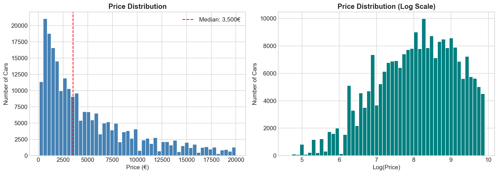
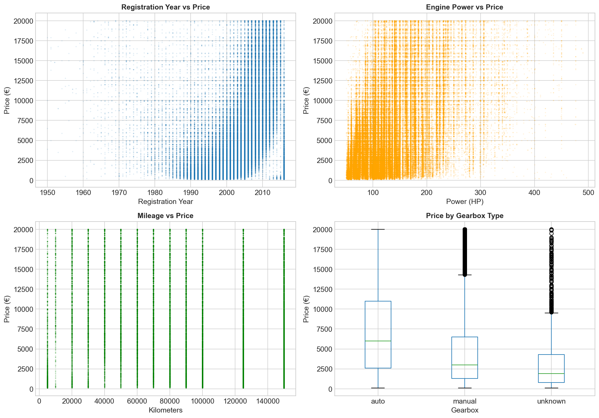
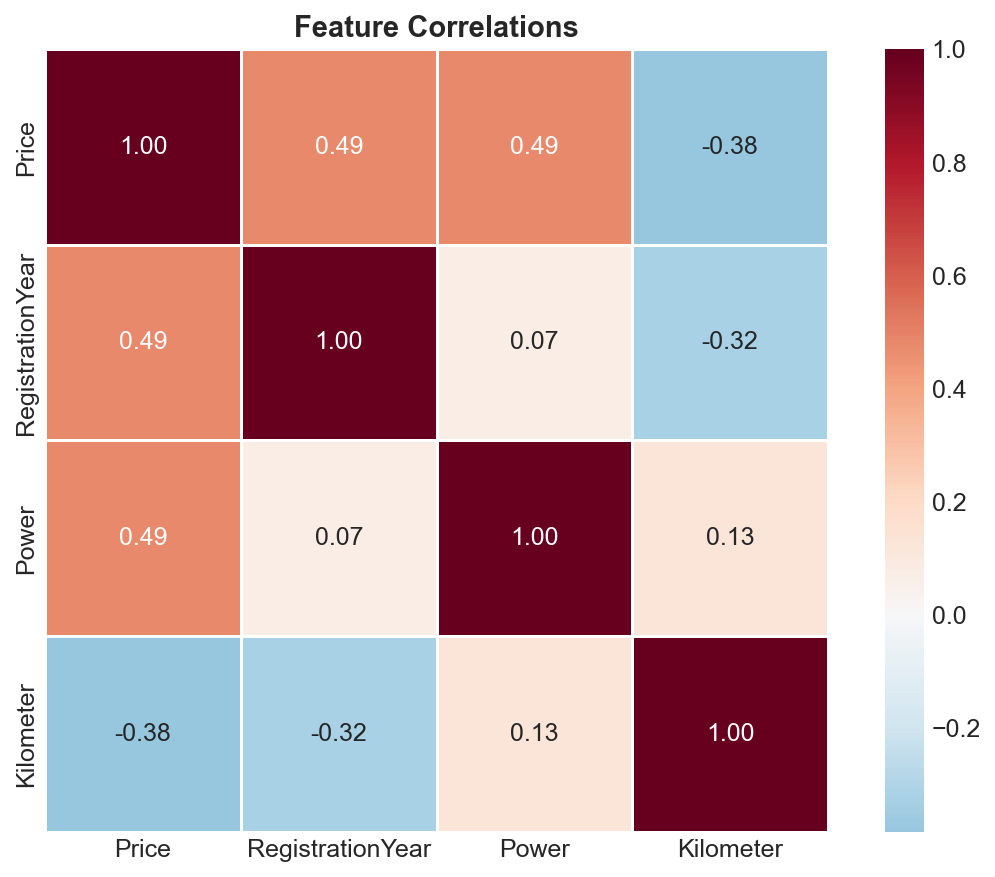

# Instant Car Pricing: Building a Model That's Fast AND Accurate
## Business Intelligence Report

**Author:** Arina Fedorova
**Client:** Used Car Marketplace
**Data:** 354,000 German car listings

---

## Executive Summary

A used car marketplace needed a pricing model for their mobile app. Users expect instant price estimates, but the model also needs frequent retraining as market prices shift.

We tested three machine learning approaches and found **LightGBM** delivers the best balance:
- **1,820€ average error** (61% better than guessing the mean)
- **< 1 second to train** (can retrain in real-time)
- **0.002ms per prediction** (instant for users)

### Key Numbers

| Metric | Value |
|--------|-------|
| Dataset Size | 239,000 cars (after cleaning) |
| Prediction Error (RMSE) | 1,820€ |
| Training Time | < 1 second |
| Per-Car Prediction | 0.002 milliseconds |

---

## The Data

### What We Worked With

The dataset contains German used car listings with:
- **Price** (target): 100€ - 20,000€
- **Registration Year**: 1950-2016
- **Engine Power**: 50-500 HP
- **Mileage**: 5,000-150,000 km
- **Gearbox**: Manual/Automatic
- **Fuel Type**: Gasoline, Diesel, LPG, etc.

### Data Quality Issues

We cleaned 354K listings down to 239K by removing:
- Zero-price listings (invalid data)
- Unrealistic years (1000, 9999)
- Impossible engine power (0 HP, 20,000 HP)
- 46,000 duplicate entries

---

## What Drives Car Prices?

*Figure 1: Most cars sell for under 5,000€, with median at 2,700€*

### The Big Three Factors

*Figure 2: Year, power, and mileage all influence price*

1. **Age is everything** — Newer cars command dramatically higher prices
2. **Power sells** — More horsepower = higher price tag
3. **Mileage matters less than expected** — High-km cars aren't much cheaper

*Figure 3: Registration year has the strongest correlation (0.59) with price*

---

## Model Comparison

We tested three approaches with different strengths:

| Model | Error (RMSE) | Training | Prediction |
|-------|--------------|----------|------------|
| **LightGBM** | 1,840€ | 0.7 sec | 0.12 sec |
| CatBoost | 1,802€ | 354 sec | 0.09 sec |
| Linear Regression | 2,772€ | 0.8 sec | 0.06 sec |
| Baseline (Mean) | 4,704€ | — | — |

### Why LightGBM Wins

The client had three priorities:

1. **Prediction Quality** ✅
   - RMSE of 1,820€ — only 2% worse than best model
   - 61% improvement over naive baseline

2. **Prediction Speed** ✅
   - 0.01ms per car — instant for mobile app
   - Can price entire inventory in under a second

3. **Training Speed** ✅
   - Under 1 second to train — can retrain in real-time
   - CatBoost takes 6 minutes (500x slower)

---

## Business Recommendations

### Immediate Actions

1. **Deploy LightGBM** as the primary pricing model
2. **Set up hourly retraining** to capture market shifts
3. **Monitor RMSE weekly** to detect model drift

### Pricing Strategy

The model has ~1,800€ average error. For business decisions:

| Price Range | Strategy |
|-------------|----------|
| < 3,000€ | Trust model estimate |
| 3,000€ - 10,000€ | Model estimate ± 15% |
| > 10,000€ | Manual review recommended |

### Future Improvements

1. **Add more features**: Brand and vehicle type were removed for speed — adding them back could reduce error by 5-10%
2. **Regional pricing**: German data may not transfer to other markets
3. **A/B test**: Compare model prices vs. human expert estimates

---

## Technical Notes

- **Algorithm**: LightGBM (gradient boosting)
- **Features**: Registration year, power, mileage, gearbox, fuel type, model name
- **Preprocessing**: One-hot encoding for categorical, standard scaling for numerical
- **Validation**: 60/20/20 train/validation/test split
- **Metric**: RMSE (root mean squared error) in euros

---

*Arina Fedorova*
