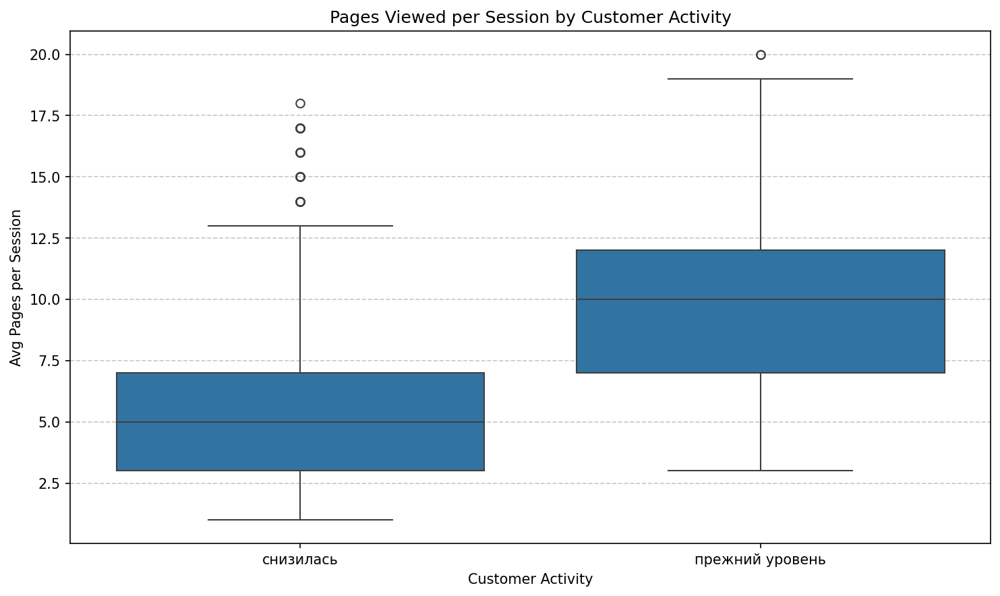
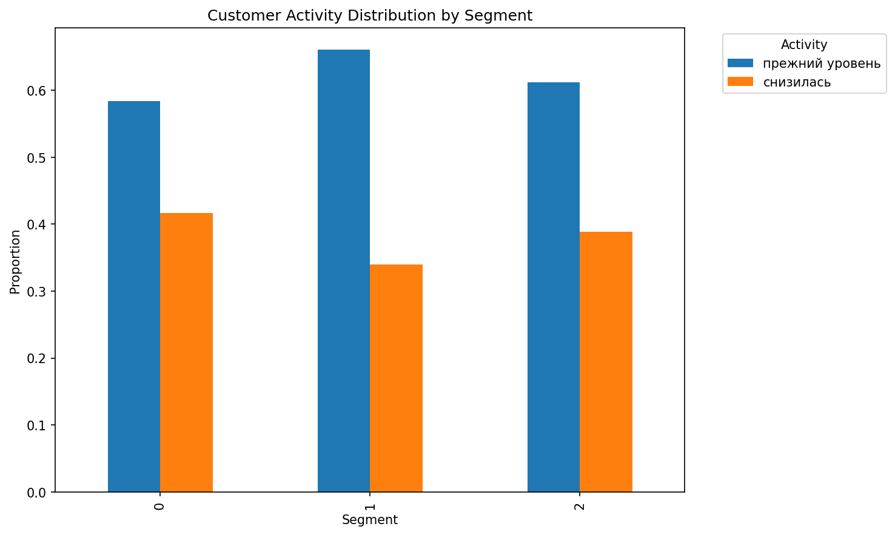

# Customer Retention: Predicting and Preventing Churn
## Business Intelligence Report

**Author:** Arina Fedorova
**Client:** E-commerce Store
**Data:** 1,300 customers with behavioral, transactional, and communication data

---

## Executive Summary

An e-commerce store faced declining purchase activity among regular customers. We built a machine learning system that:

1. **Predicts churn** with 91% accuracy (F1 score)
2. **Segments customers** into 3 actionable groups
3. **Identifies key drivers** of customer activity decline

### Key Numbers

| Metric | Value |
|--------|-------|
| Prediction Accuracy (F1) | 91% |
| Improvement over Baseline | 90% |
| High-Risk Segment | 42% of premium users |
| Top Predictor | Pages viewed per session |

---

## The Business Problem

The store noticed:
- Regular customers reducing purchase frequency
- Revenue concentration shifting to new customers
- Marketing campaigns showing inconsistent results

**Goal:** Identify at-risk customers BEFORE they churn, enabling proactive retention.

---

## What Predicts Customer Churn?

### Top 5 Predictive Features (SHAP Analysis)

1. **Pages per Session** — Most important predictor. Declining page views signal disengagement.
2. **Time on Site** — Both recent and historical time spent matters.
3. **Marketing Response** — Communication frequency correlates with retention.
4. **Promo Purchases** — Heavy promo reliance indicates price sensitivity.
5. **Cart Abandonment** — Higher abandonment rates in churning customers.

### Key Insights

*Figure: Stable customers view 2x more pages per session than declining customers*

- **Engagement drops first**: Behavioral signals appear before purchase decline
- **Premium users at risk**: 50% show declining activity despite higher service tier
- **Category matters**: "Children's products" has highest churn volume

---

## Customer Segmentation

We identified 3 distinct customer segments using K-Means clustering:

| Segment | Size | Churn Rate | Profile |
|---------|------|------------|---------|
| **0** | 497 | 42% | Premium, long-tenure, high-value |
| **1** | 480 | 34% | Standard, mid-tenure |
| **2** | 319 | 39% | Mixed, shorter-tenure |

### Segment 0: Premium At-Risk (Highest Priority)
- Longest customer relationships (avg 800 days)
- Premium service tier
- **42% showing activity decline**
- Strategy: Exclusive loyalty rewards, personal outreach

### Segment 1: Standard Declining (Medium Priority)
- Mid-tenure customers (avg 400 days)
- Standard service tier
- 35% declining
- Strategy: Re-engagement campaigns, upgrade offers

### Segment 2: Mixed Profile (Medium Priority)
- Smaller segment, mixed characteristics
- 39% declining — needs attention
- Strategy: Targeted re-engagement, segment-specific offers

---

## Model Performance

We tested 4 classification algorithms:

| Model | F1 Score | Notes |
|-------|----------|-------|
| **SVC** | 0.91 | Best performer |
| Logistic Regression | 0.85 | Good baseline |
| Decision Tree | 0.82 | Most interpretable |
| KNN | 0.80 | Slowest |
| Baseline (DummyClassifier) | 0.48 | Random guessing |

**SVC (Support Vector Classifier)** achieved 91% F1 score — nearly double the baseline.

---

## Business Recommendations

### Immediate Actions

1. **Deploy Prediction Model**
   - Score all customers monthly
   - Flag those with >60% churn probability

2. **Prioritize Segment 0**
   - Premium users generate most revenue
   - 42% at risk = significant revenue exposure
   - Personal outreach from account managers

3. **Monitor Page Views**
   - Top predictor of churn
   - Alert when customer's pages/session drops 30%+

### Retention Strategies by Segment

| Segment | Strategy | Expected Impact |
|---------|----------|-----------------|
| Premium At-Risk | Exclusive loyalty club, early access | -15% churn |
| Standard Declining | Email re-engagement, 10% comeback offer | -10% churn |
| Engaged Stable | Cross-sell premium, referral rewards | +5% revenue |

### Future Improvements

1. **Real-time scoring**: Integrate model into app for live alerts
2. **A/B test interventions**: Measure which strategies work per segment
3. **Add recency features**: Days since last purchase, visit frequency trends

---

## Technical Notes

- **Algorithm**: SVC with RBF kernel
- **Features**: 15 behavioral + transactional + communication features
- **Preprocessing**: StandardScaler for numerical, OneHotEncoder for categorical
- **Validation**: 80/20 train/test split with stratification
- **Metric**: F1 weighted (handles class imbalance)
- **Interpretability**: SHAP values for feature importance

---

*Arina Fedorova*
