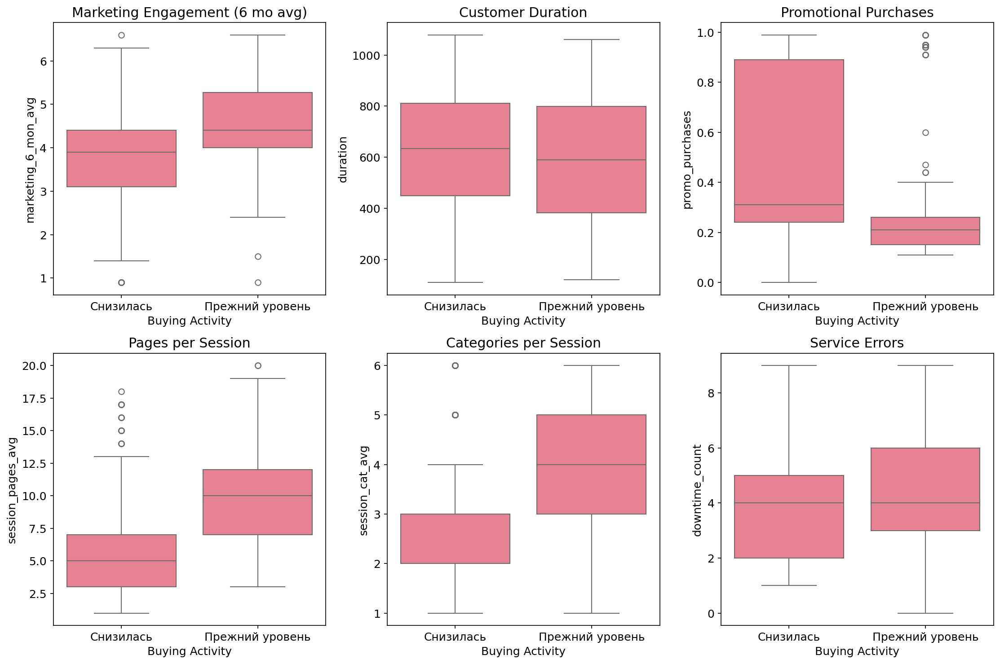

# Why Customers Stop Buying (And How to Catch Them Before They Do)

## The Starting Point

An online store came with a familiar problem: customers were slipping away. Not dramatically - they weren't complaining or making a scene. They just... bought less. Visited less often. Responded to fewer emails. And eventually, they disappeared.

The question wasn't complicated: can we spot these customers before they're gone?

## What the Data Showed

We had four years of customer behavior data. Page views, purchases, time on site, email responses - the usual. About 1,300 customers, enough to work with.

The first thing we noticed: roughly 38% of customers were already showing signs of decline. That's not a small leak. That's a problem.

But here's what was interesting. These customers didn't look different from loyal ones when they first signed up. Same demographics, same initial behavior. The difference showed up in how they engaged over time.

*Figure 1: Key behavioral differences between active and declining customers*

**The warning signs:**

1. **Fewer pages per visit.** This was the biggest tell. Customers who used to browse 10-15 pages per session started looking at 3-4. They came, grabbed what they needed, and left. No exploring, no discovering new products.

2. **Ignoring marketing emails.** Open rates dropped. Click-through rates dropped further. The relationship was going cold.

3. **Longer gaps between visits.** Weekly shoppers became monthly shoppers. Monthly shoppers became "maybe next quarter" shoppers.

4. **Smaller carts.** Not necessarily less money per visit, but fewer items considered. Less time spent deciding.

## The Model

We tested several approaches. Support Vector Classifier won - F1 score of 0.90 on held-out data, which means it catches most at-risk customers without flagging too many false positives.

The model looks at engagement patterns, purchase history, and response to marketing. It outputs a risk score. High score means this customer is heading for the exit.

## Three Types of At-Risk Customers

Clustering revealed something useful: not all declining customers are the same.

**Group 1: The Burned Out**
These were once your best customers. High engagement, frequent purchases. Now they're tired. Maybe too many emails. Maybe they bought everything they needed. They're not angry - just done.

*What works:* Give them space. Reduce email frequency. When you do reach out, make it count - exclusive access, early previews, something that says "we remember you're special."

**Group 2: The Price Shoppers**
They came for deals and stayed for deals. When the deals dried up, so did their interest. Moderate engagement, highly sensitive to price.

*What works:* Loyalty discounts. Bundle offers. Free shipping thresholds that feel achievable. Don't try to make them love your brand - just make the math work.

**Group 3: The Almost-Buyers**
High browsing, low conversion. They look, they compare, they leave. Cart abandonment is their specialty.

*What works:* Simplify checkout. Send abandoned cart reminders (but don't be creepy about it). Time-limited discounts on items they viewed.

## What To Do With This

**Short term:**
- Run the model weekly. Flag customers with risk scores above threshold.
- Match flagged customers to their segment. Send the right message to the right group.
- Track who comes back. Learn what works.

**Longer term:**
- Fix the page views problem. If customers aren't exploring, maybe the site isn't inviting exploration. That's a UX issue, not a marketing issue.
- Rethink email frequency. More isn't better. Relevant is better.
- Build in feedback loops. The model will drift as customer behavior changes. Retrain it.

## The Honest Assessment

This model catches patterns, not causes. It can tell you who's leaving, but not always why. A customer might be flagged as high-risk because they got a new job and have less time to browse - no amount of marketing will change that.

Use the predictions as a starting point, not a verdict. The segments are guides, not scripts. Test what works with your actual customers.

---

*Arina Fedorova*
