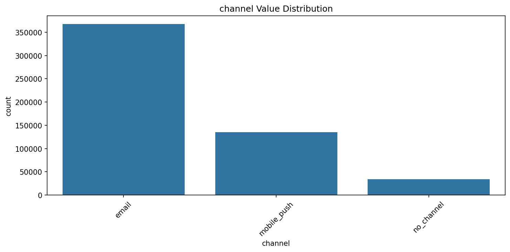
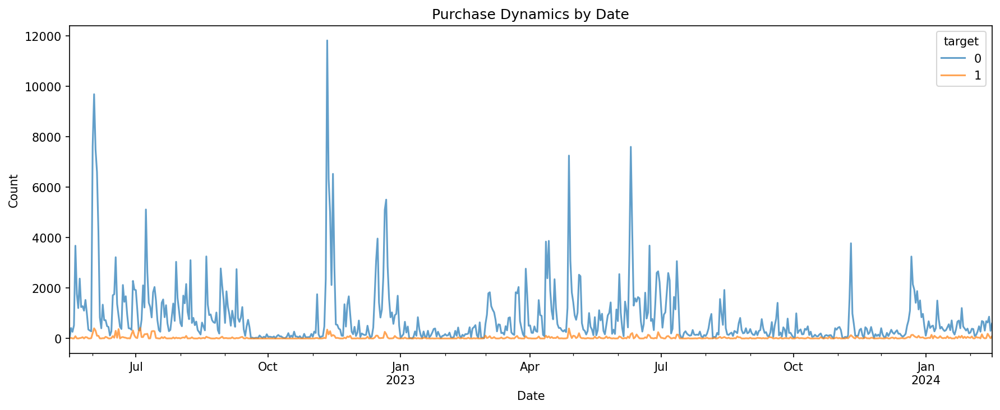
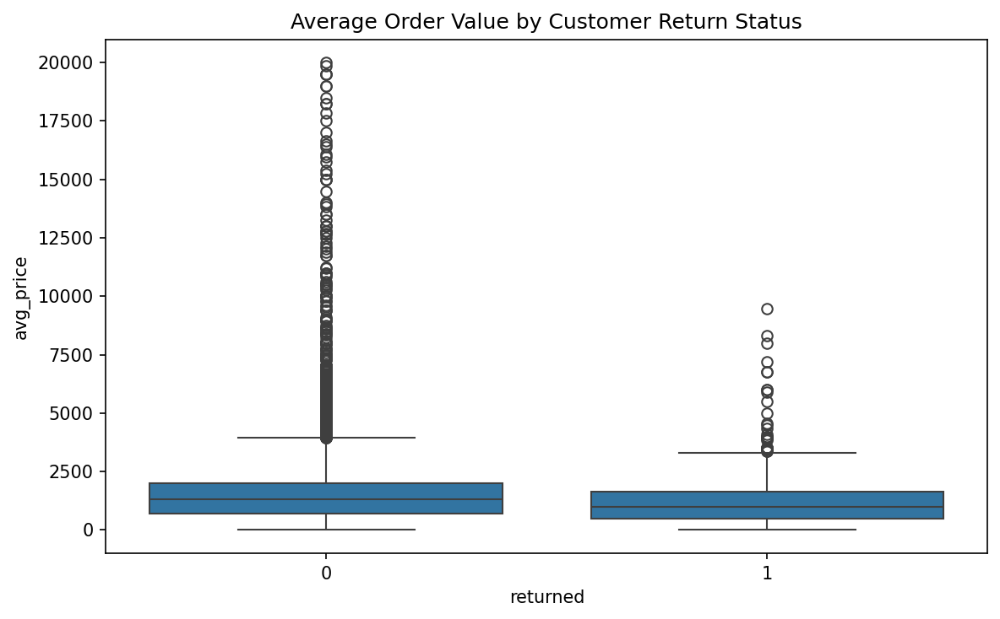
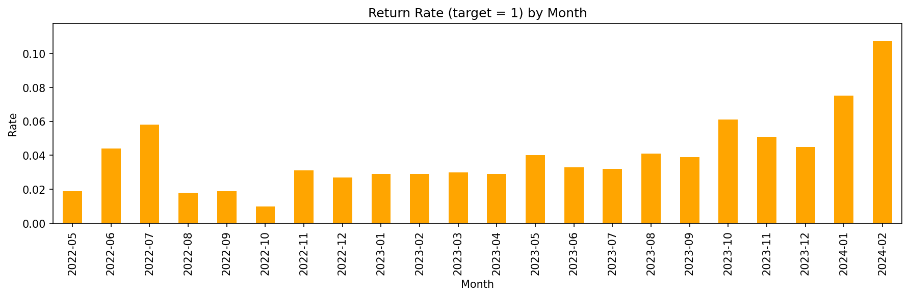
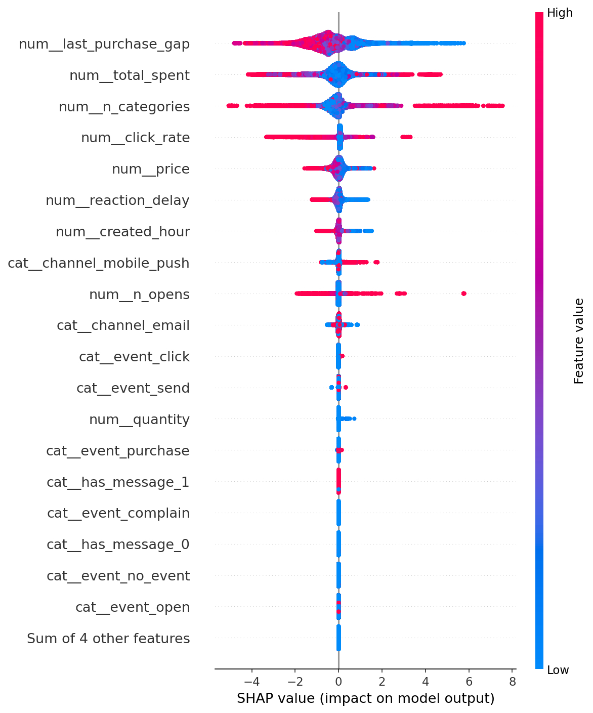

# Turning One-Time Buyers into Loyal Customers
## Marketing Analytics Report: Predicting Customer Returns

**Author:** Arina Fedorova
**Client:** Apparel E-commerce Company
**Data:** 12.7M marketing interactions, 202K purchases, 49K customers

---

## Executive Summary

An apparel retailer wanted to understand which customers would return after receiving marketing messages. We built a prediction model that identifies returners with **95% accuracy**, revealing surprising insights about customer behavior.

### Key Numbers

| Metric | Value |
|--------|-------|
| Prediction Accuracy (ROC AUC) | 95% |
| Return Rate (with marketing) | 3.8% |
| Return Rate (without marketing) | 2.8% |
| Push vs Email Advantage | +17% conversion |

**Bottom Line:** Marketing messages drive +1% incremental returns. But WHO you target matters more than how many messages you send.

---

## The Challenge: Finding Needles in a Haystack

The marketing team faced a classic dilemma:

> *"We send millions of emails and push notifications, but only 3-4% of customers return. How do we find those customers BEFORE they convert?"*

### The Data Landscape

- **12.7 million** marketing messages sent
- **202,000** purchases tracked
- **49,000** customers analyzed
- Time span: May 2022 – February 2024

The challenge: with 96% of customers NOT returning, the signal is buried in noise.

---

## Discovery #1: Push Beats Email

Our first surprise came from channel analysis:

| Channel | Return Rate | Volume |
|---------|-------------|--------|
| Push Notifications | **4.2%** | 7.5M messages |
| Email | 3.6% | 5.2M messages |
| No Message (organic) | 2.8% | — |

**Insight:** Push notifications convert 17% better than email, yet email gets equal or higher budget allocation. This represents an immediate optimization opportunity.

---

## Discovery #2: Big Sales ≠ Loyal Customers

We expected promotional spikes to drive retention. We were wrong.

The chart reveals a striking pattern:
- **Blue spikes** = Sales events (promotions, seasonal campaigns)
- **Orange line** = Returning customers (flat, stable)

**The hard truth:** Mass promotions attract one-time buyers, not loyal customers. The June 2022 and 2023 spikes show record sales — but zero lift in return rates.

---

## Discovery #3: The Loyal Customer Profile

Who actually returns? The data revealed a counterintuitive profile:

### Returning Customers:
- **Lower average order value** (buy cheaper items)
- **More diverse categories** (explore broadly)
- **Faster response** to messages (act within 24h)
- **Recent activity** (last purchase < 30 days ago)

### One-Time Buyers:
- Higher average order value
- Single category focus
- Slow or no response to messages
- Long gaps between visits

**Insight:** Your best repeat customers aren't the big spenders — they're the engaged explorers who respond quickly and browse widely.

---

## Discovery #4: Return Rates Are Improving

A positive trend emerged in late 2023:
- 2022: Return rates stable at 1-3%
- Early 2023: Fluctuating, 2-5%
- Late 2023+: Steady climb to **10%+ in February 2024**

Possible explanations:
- Improved product recommendations
- Better email personalization
- Enhanced mobile app experience
- Seasonality effects (holiday gift returns)

---

## The Prediction Model

We tested four machine learning algorithms:

| Model | ROC AUC | Notes |
|-------|---------|-------|
| **XGBoost** | **0.9496** | Best performer |
| LightGBM | 0.94 | Close second |
| Random Forest | 0.91 | Good interpretability |
| Logistic Regression | 0.87 | Fast baseline |

### What Drives Predictions? (SHAP Analysis)

**Top 5 Predictors:**

1. **Days since last purchase** — Recent buyers 3x more likely to return
2. **Total lifetime spending** — Higher CLV = higher loyalty
3. **Category diversity** — Explorers become repeat buyers
4. **Click rate** — Message engagement predicts action
5. **Response speed** — Fast reactors are your best customers

---

## Actionable Recommendations

### 1. Shift Budget to Push Notifications

| Current Allocation | Recommended |
|--------------------|-------------|
| Email: 60% | Email: 40% |
| Push: 40% | Push: 60% |

**Expected impact:** +0.5% overall return rate = thousands of additional repeat customers.

### 2. Target the Right Customers

Create three priority tiers based on model scores:

| Tier | Criteria | Action |
|------|----------|--------|
| **Hot** (Top 10%) | >80% return probability | Exclusive early access, VIP treatment |
| **Warm** (Next 30%) | 40-80% probability | Standard campaigns, cross-sell |
| **Cold** (Bottom 60%) | <40% probability | Reduce frequency, reactivation only |

### 3. Intervene Before It's Too Late

| Days Since Purchase | Risk Level | Action |
|--------------------|------------|--------|
| 0-30 days | Low | Cross-sell, category expansion |
| 31-60 days | Medium | Re-engagement, "We miss you" |
| 60+ days | High | Win-back offer, discount |

### 4. Nurture Category Explorers

Customers who buy from 3+ categories have 2x higher return rates.

**Tactic:** After first purchase, send personalized recommendations from adjacent categories within 7 days.

---

## Implementation Roadmap

### Phase 1: Quick Wins
- Shift 10% budget from email to push notifications
- Create "inactive 45+ days" customer segment
- Launch win-back campaign for high-CLV dormant customers

### Phase 2: Model Integration
- Deploy scoring model to CRM system
- Score all customers weekly
- Create automated tier-based campaigns

### Phase 3: Optimization
- A/B test push vs email for each segment
- Implement real-time scoring
- Build category recommendation engine

---

## Appendix: Technical Details

- **Algorithm:** XGBoost Classifier (max_depth=5, n_estimators=100)
- **Training Data:** 428K records (80/20 split)
- **Validation:** 5-fold stratified cross-validation
- **Key Features:** 9 numerical + 3 categorical
- **Preprocessing:** StandardScaler + OneHotEncoder
- **Interpretability:** SHAP TreeExplainer

---

*Report prepared by Arina Fedorova*
*Data Science & Marketing Analytics*
