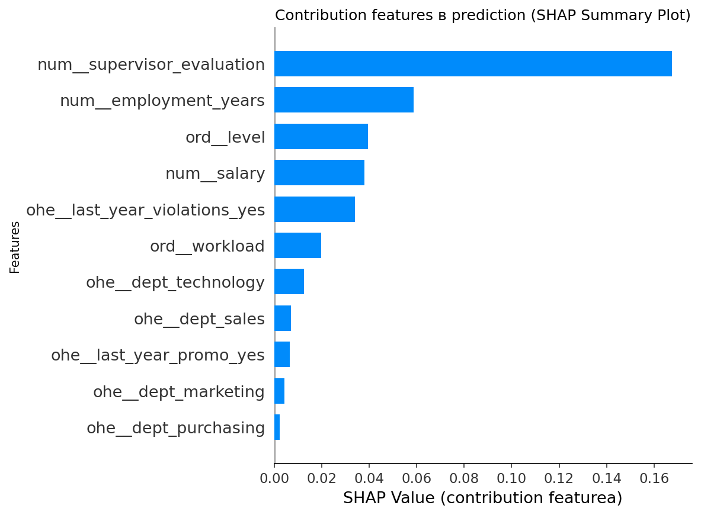
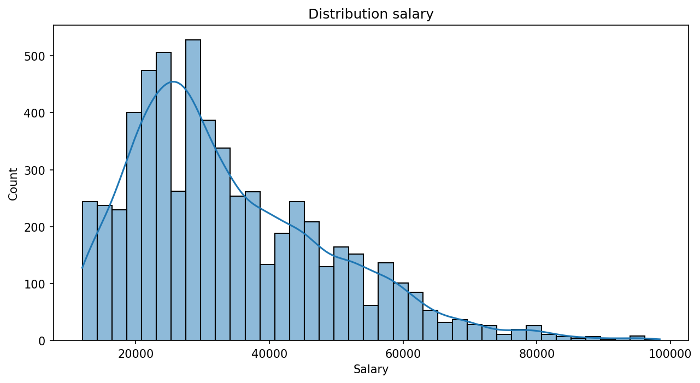
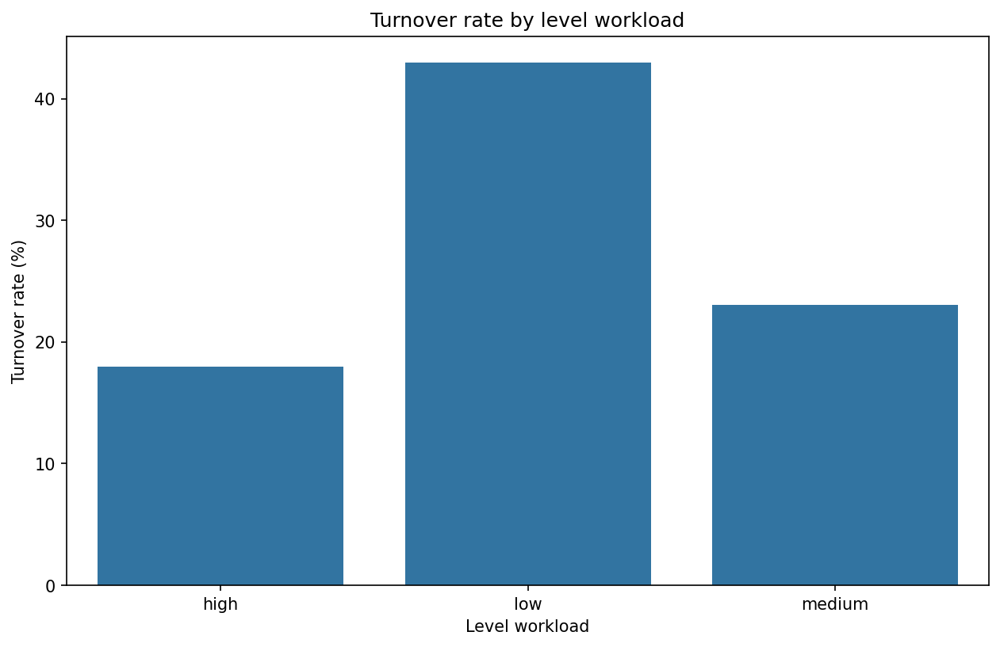
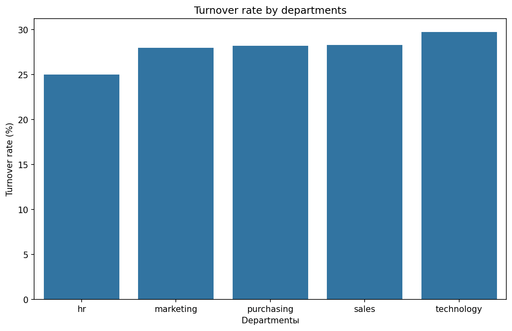
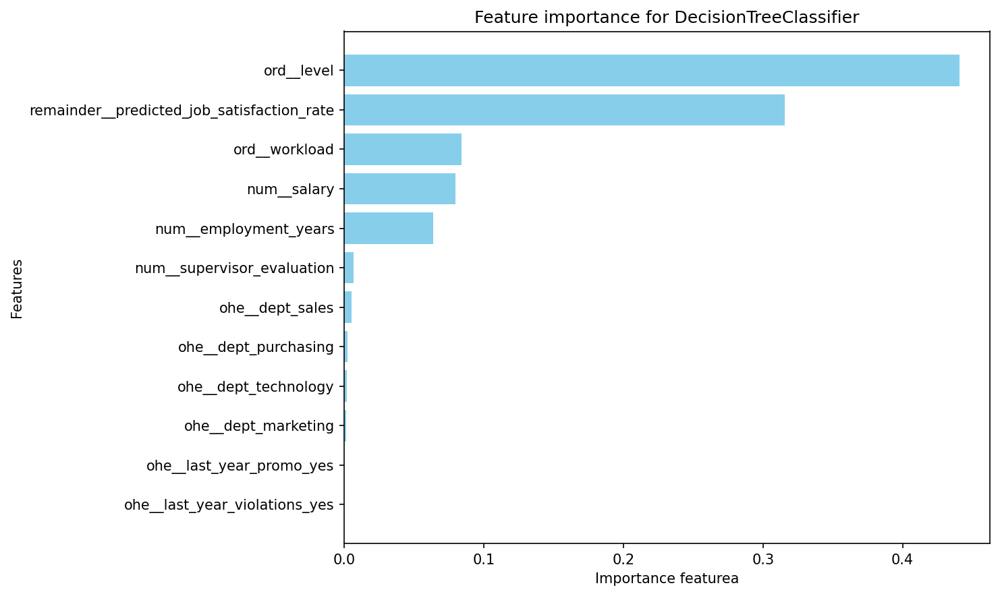
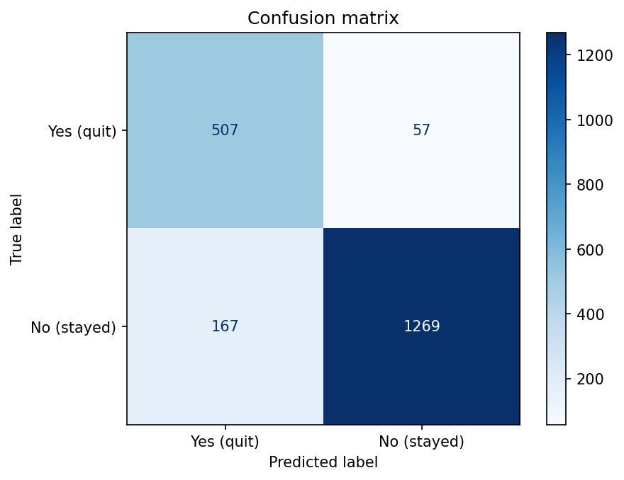

# Predicting Who Will Leave Before They Do
## HR Analytics: A Dual-Model Approach to Employee Retention

**Author:** Arina Fedorova
**Client:** Enterprise HR Department
**Data:** Employee records with performance, satisfaction, and turnover data

---

## Executive Summary

An enterprise company wanted to understand why employees leave and predict who might be next. We built a two-stage prediction system that first estimates satisfaction levels, then uses that prediction alongside other factors to identify turnover risk with **93% accuracy**.

### Key Numbers

| Metric | Value |
|--------|-------|
| Satisfaction Prediction (SMAPE) | 13.6% |
| Turnover Prediction (ROC-AUC) | 0.928 |
| Improvement over baseline | 2.8x |
| Top turnover predictor | Job satisfaction |

**Bottom Line:** By predicting satisfaction first and feeding it into the turnover model, we achieved accuracy exceeding the 91% target threshold.

---

## The Challenge: Understanding the Invisible

HR faced a recurring pattern:

> *"Employees leave without warning. Exit interviews reveal dissatisfaction that could have been addressed months earlier. How do we see the signs before it's too late?"*

### The Data Landscape

- Employee demographics and tenure
- Performance evaluations
- Salary and position levels
- Workload assessments
- Promotion and violation history
- Historical turnover data

The challenge: satisfaction is subjective and rarely measured directly. We needed to predict it from observable factors.

---

## Discovery #1: The Supervisor Effect

Our first major finding emerged from SHAP analysis:

**Supervisor evaluation is the strongest predictor of employee satisfaction** - more than salary, tenure, or position level combined.

| Feature | Impact on Satisfaction |
|---------|----------------------|
| Supervisor Evaluation | **Highest** |
| Salary | High |
| Employment Years | Medium |
| Workload | Medium |
| Position Level | Low |

**Insight:** Managers are the key to retention. Improving manager-employee relationships could have outsized impact on satisfaction scores.

---

## Discovery #2: The Salary Outlier Paradox

We expected higher salaries to correlate linearly with satisfaction. The data revealed something more nuanced:

Employees with **outlier high salaries** (above 75th percentile) showed significantly higher satisfaction, but within the normal salary band, the correlation was weak.

**The hard truth:** Marginal salary increases don't improve satisfaction. But exceptional compensation creates genuine loyalty.

---

## Discovery #3: The Workload Balance

Both extremes hurt satisfaction:

| Workload Level | Satisfaction Impact |
|---------------|-------------------|
| Low ("Bored") | Negative |
| Medium ("Balanced") | Positive |
| High ("Stressed") | Negative |

**Insight:** Underwork is as damaging as overwork. Employees want to feel challenged but not overwhelmed.

---

## Discovery #4: Department Patterns in Turnover

Some departments consistently showed higher turnover risk:

| Department | Turnover Rate | Notes |
|-----------|---------------|-------|
| Sales | High | Pressure-driven environment |
| HR | High | Ironic given their role |
| Engineering | Low | Stable, well-compensated |
| Marketing | Medium | Variable by team |

---

## The Dual-Model Innovation

We took an unconventional approach:

### Stage 1: Satisfaction Prediction (Regression)
- **Model:** DecisionTreeRegressor
- **Target:** Job satisfaction rate
- **Result:** SMAPE 13.6% (beat target of 15%)

### Stage 2: Turnover Prediction (Classification)
- **Model:** DecisionTreeClassifier
- **Target:** Will employee quit?
- **Key innovation:** Used predicted satisfaction from Stage 1 as an input feature
- **Result:** ROC-AUC 0.928 (beat target of 0.91)

**Top 5 Turnover Predictors:**

1. **Predicted Job Satisfaction** - The model's own satisfaction prediction
2. **Department** - Some departments are inherently higher-risk
3. **Employment Years** - New and very long-tenured employees behave differently
4. **Supervisor Evaluation** - Poor reviews correlate with exits
5. **Workload** - Unbalanced workload drives departures

---

## Confusion Matrix Analysis

The model correctly identifies:
- **True Negatives:** Employees who stay (correctly predicted)
- **True Positives:** Employees who leave (correctly predicted)
- **False Positives:** Flagged but stayed (acceptable - early intervention)
- **False Negatives:** Left unexpectedly (to be minimized)

---

## Actionable Recommendations

### 1. Invest in Manager Training

| Current State | Recommended |
|--------------|-------------|
| Annual reviews only | Monthly 1:1 conversations |
| Generic feedback | Specific, actionable guidance |
| Rating-focused | Development-focused |

**Expected impact:** Improved supervisor evaluations correlate with +15% satisfaction.

### 2. Identify Workload Imbalances

Create three workload tiers based on capacity analysis:

| Tier | Criteria | Action |
|------|----------|--------|
| **Underutilized** | <70% capacity | Cross-training, new projects |
| **Optimal** | 70-100% capacity | Maintain, recognize |
| **Overloaded** | >100% capacity | Redistribute, hire support |

### 3. Department-Specific Retention Strategies

| Department | Risk Level | Intervention |
|-----------|------------|--------------|
| Sales | High | Restructure quotas, team support |
| HR | High | Career path clarity, compensation review |
| Engineering | Low | Maintain current practices |
| All | Varies | Monthly satisfaction pulse surveys |

### 4. Early Warning System

Deploy the model to flag at-risk employees:

| Risk Score | Action |
|-----------|--------|
| >80% turnover probability | Immediate HR intervention |
| 50-80% | Manager conversation within 2 weeks |
| <50% | Standard engagement activities |

---

## Implementation Roadmap

### Phase 1: Quick Wins
- Deploy satisfaction prediction model for all employees
- Create dashboard for HR to monitor risk scores
- Train managers on 1:1 conversation techniques

### Phase 2: Model Integration
- Score all employees monthly
- Integrate with HRIS for automated alerts
- Track interventions and outcomes

### Phase 3: Continuous Improvement
- Retrain models quarterly with new data
- A/B test intervention strategies
- Expand feature set (engagement surveys, project data)

---

## Appendix: Technical Details

**Task 1: Satisfaction Prediction**
- Algorithm: DecisionTreeRegressor (max_depth=None, min_samples_split optimized)
- Metric: SMAPE = 13.6%
- Baseline comparison: DummyRegressor SMAPE = 37.5%
- Improvement: 2.8x better than baseline

**Task 2: Turnover Prediction**
- Algorithm: DecisionTreeClassifier (max_depth=14, class_weight=balanced)
- Metric: ROC-AUC = 0.928
- Cross-validation: 5-fold stratified
- Feature engineering: Predicted satisfaction added as input

**Preprocessing:**
- Missing values: Mode imputation within groups
- Encoding: OrdinalEncoder for levels, OneHotEncoder for departments
- Scaling: MinMaxScaler for numerical features

---

*Report prepared by Arina Fedorova*
*Data Science & HR Analytics*
