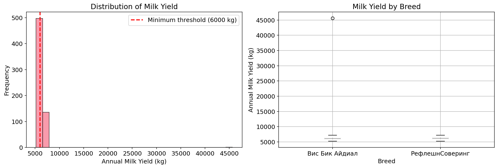
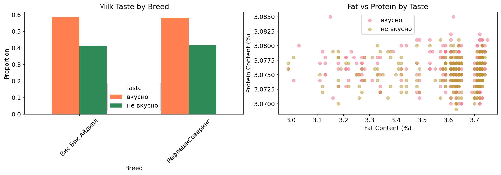

# How We Tried to Help a Farmer Buy Better Cows
## Business Intelligence Report

**Author:** Arina Fedorova
**Data Source:** Dairy Farm Records
**Analysis:** 634 cows with production and quality data

---

## Executive Summary

A dairy farmer asked us to predict two things before buying new cows: how much milk they'll produce, and whether it'll taste good. We built two models. One worked, one didn't.

The quality prediction model successfully identifies cows likely to produce tasty milk based on fat content, protein levels, and breed. The yield prediction model failed - the features we have don't capture what actually drives milk production.

### The Bottom Line
- **Quality model**: Working, ready for use
- **Yield model**: Needs better data
- **Recommendation**: Use quality predictions now, assess yield manually

---

## The Data

We analyzed records from 634 cows in the farmer's current herd.

| Dataset | Records | Purpose |
|---------|---------|---------|
| Main herd | 634 cows | Production and quality history |
| Father data | 629 records | Breeding information |
| Purchase candidates | 20 cows | New cows to evaluate |

**Key Variables:**
- Annual milk yield (kg)
- Fat content (%)
- Protein content (%)
- Milk taste rating (tasty/not tasty)
- Breed, pasture type, age, father's breed

---

## What the Data Shows

### Milk Yield Distribution

*Figure 1: Left - yield distribution with 6,000 kg threshold. Right - yield by breed*

The yield histogram tells us something important: most cows cluster around 6,000-6,500 kg annually, right at the target threshold. The red line marks 6,000 kg - the minimum acceptable yield.

Some cows produce well above 7,000 kg. Others fall below 5,000 kg. The question is: can we predict which is which before buying?

The boxplot by breed shows some variation - certain breeds have higher medians - but the overlap is substantial. Breed alone doesn't guarantee high yield.

### Milk Quality Patterns

*Figure 2: Left - taste distribution by breed. Right - fat vs protein content by taste*

Here's where things get interesting. The scatter plot shows clear separation: cows producing tasty milk cluster in one region of fat-protein space, while those producing bad-tasting milk cluster elsewhere.

This is good news for modeling. If we can draw a line (or curve) through this space, we can predict taste before buying.

The breed chart confirms that some breeds produce consistently tasty milk, while others are hit-or-miss. This gives us predictive power.

---

## The Models

We built two models with very different outcomes.

### Quality Prediction (Worked)

**Approach:** Logistic Regression with features including fat content, protein content, breed, pasture type, and age.

**Results:**
| Metric | Value |
|--------|-------|
| Precision | 0.71 at threshold 0.75 |
| Recall | Varies by threshold |
| Class balance | 58% tasty, 42% not tasty |

The model successfully separates tasty from not-tasty milk based on composition and breed. At higher confidence thresholds, we can be more certain about predictions - at the cost of missing some good cows.

### Yield Prediction (Didn't Work)

**Approach:** Gradient Boosting Regressor with features including breed, pasture type, feed composition, father's breed, and age.

**Results:**
| Model | R² (Train) | R² (Test) |
|-------|------------|-----------|
| Linear Regression | 0.11 | -0.56 |
| Ridge Regression | 0.11 | -0.51 |
| Gradient Boosting | 0.99 | -1.50 |

Negative R² on test data means the model performs worse than just predicting the herd average. Gradient Boosting memorized the training data perfectly (R² = 0.99) but learned nothing generalizable.

**Why it failed:**
- The features we have (breed, feed, pasture) capture maybe 10% of yield variance
- True yield drivers - genetics, individual health, seasonal factors - aren't in our data
- The father's breed is recorded, but not his actual production history

*Figure 3: Left - yield model scatter (poor fit). Right - quality model confusion matrix*

The scatter plot on the left shows the yield model's failure: predictions don't track actual values. The confusion matrix on the right shows the quality model working - most predictions fall on the diagonal.

---

## What This Means for the Farmer

### Use the Quality Model Now

Before buying any cow:
1. Get her fat content, protein content, and breed
2. Run through the quality model
3. If probability of "tasty" is below 0.5 - don't buy
4. If above 0.7 - confident buy (for quality)

This won't catch everything, but it will prevent the worst mistakes.

### Assess Yield Manually

Until we have better data, stick with traditional assessment:
- **Breed reputation**: Some breeds consistently produce more
- **Age**: Peak production is typically 3-5 years
- **Father's history**: Ask for his daughters' production records
- **Body condition**: Healthy cows produce more

### Collect Better Data Going Forward

Every cow purchased should be tracked:
- Monthly yield measurements
- Feed consumption
- Health events
- Breeding dates

In 1-2 years, this data could enable a working yield model.

---

## Recommendations

### Immediate Actions

| Priority | Action | Impact |
|----------|--------|--------|
| High | Deploy quality screening | Prevent bad purchases |
| Medium | Document yield manually | Build future dataset |
| Low | Track father production | Improve genetics data |

### Data Collection Strategy

For every new cow:
1. Record purchase price and seller's claims
2. Track first-year yield monthly
3. Compare predictions to reality
4. Use mismatches to improve models

### Future Model Improvements

The yield model could work with:
- Actual genetic markers (expensive but available)
- Father's production history, not just breed
- Seasonal adjustment factors
- Individual health records

Whether the improvement justifies the data collection cost depends on herd size and margins.

---

## The Honest Assessment

We promised two models. We delivered one.

The quality prediction works and can save money starting now. The yield prediction needs data we don't have - and getting that data takes time.

This is normal. Real projects rarely deliver everything on the first try. What matters is knowing what works, what doesn't, and what to do next.

---

## Technical Notes

- **Quality Model**: Logistic Regression with StandardScaler and OneHotEncoder
- **Yield Model**: Gradient Boosting Regressor (needs improvement)
- **Validation**: 25% holdout test set with stratification for classification
- **Class Balance**: 58% tasty, 42% not tasty in original data

---

*Arina Fedorova*
