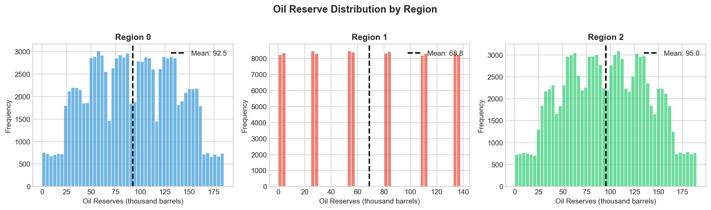
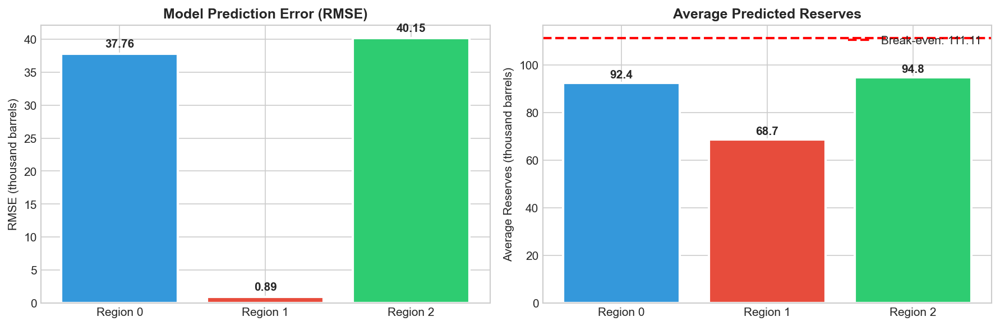
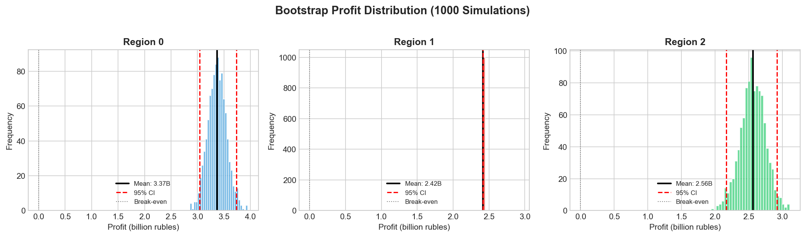

# Oil Well Location Selection: Risk-Based Investment Analysis
## Business Intelligence Report

**Author:** Arina Fedorova
**Client:** Oil Extraction Company
**Data:** Geological surveys from 3 regions (100,000 samples each)

---

## Executive Summary

An oil company needed to select the optimal region for new well development. Using machine learning and Bootstrap risk analysis, we evaluated three candidate regions:

**Recommendation: Region 0**
- **Expected profit:** 3.37 billion rubles
- **95% confidence:** [3.04, 3.74] billion rubles
- **Loss risk:** 0%

### Key Numbers

| Metric | Value |
|--------|-------|
| Investment Required | 10 billion rubles |
| Wells to Develop | 200 |
| Expected Return | 33.7% |
| Risk of Loss | 0% |

---

## The Business Problem

The company has geological data from three potential drilling regions. Each region has 100,000 surveyed points with three measurements (f0, f1, f2) and known oil reserve volumes.

**Constraints:**
- Budget: 10 billion rubles
- Can develop 200 wells per region
- Minimum acceptable profit: 0 (no losses)
- Maximum acceptable loss probability: 2.5%

**Goal:** Choose the region that maximizes profit while keeping risk below threshold.

---

## Data Overview

### Reserve Distribution by Region

| Region | Avg Reserves (thousand barrels) | Std Dev |
|--------|--------------------------------|---------|
| 0 | 92.50 | 44.29 |
| 1 | 68.82 | 45.94 |
| 2 | 95.00 | 44.75 |

**Key observation:** Region 2 has the highest average reserves, but averages alone don't determine profitability — we select only the TOP 200 wells.

---

## Model Performance

We trained Linear Regression models to predict reserve volumes from geological features.

| Region | RMSE | Interpretation |
|--------|------|----------------|
| 0 | 37.76 | High uncertainty |
| **1** | **0.89** | Near-perfect predictions |
| 2 | 40.15 | Highest uncertainty |

**Why Region 1 has such low RMSE:**
The geological features in Region 1 have a nearly linear relationship with reserves, making prediction extremely accurate. However, low reserves mean lower profit potential.

---

## Profit Analysis

### Break-even Calculation

| Parameter | Value |
|-----------|-------|
| Budget | 10,000,000,000 RUB |
| Wells developed | 200 |
| Price per 1000 barrels | 450,000 RUB |
| **Break-even per well** | **111.11 thousand barrels** |

All regions have average reserves below break-even. However, we select the **best 200 wells**, not average ones.

### Estimated Profit (Top 200 Wells)

| Region | Profit (billion RUB) |
|--------|---------------------|
| **0** | **3.36** |
| 1 | 2.42 |
| 2 | 2.60 |

---

## Risk Assessment: Bootstrap Analysis

Bootstrap resampling (1000 iterations) provides confidence intervals and loss probability estimates.

### Results Summary

| Region | Mean Profit | 95% CI (billion RUB) | Loss Risk |
|--------|-------------|---------------------|-----------|
| **0** | **3.37B** | [3.04, 3.74] | **0%** |
| 1 | 2.42B | [2.42, 2.42] | 0% |
| 2 | 2.56B | [2.17, 2.92] | 0% |

### Interpretation

1. **Region 0:** Highest profit, narrow CI — recommended
2. **Region 1:** Lowest profit, but most predictable (zero variance in bootstrap due to near-perfect model accuracy)
3. **Region 2:** Medium profit, wider CI — higher uncertainty

---

## Final Recommendation

**Develop Region 0**

| Factor | Assessment |
|--------|------------|
| Expected Profit | **3.37 billion RUB** (highest) |
| Confidence Interval | [3.04, 3.74] — narrow, reliable |
| Loss Risk | **0%** — well below 2.5% threshold |
| Model Uncertainty | Higher RMSE (37.76), but compensated by larger reserves |

### Trade-off Analysis

While Region 1 offers near-perfect predictions (RMSE = 0.89), its lower reserve volumes result in 39% less profit than Region 0. The prediction uncertainty in Region 0 is acceptable given:

1. All 1000 bootstrap samples produced positive profit
2. Even the lower bound (3.04B) exceeds Region 1's profit (2.42B)
3. Zero probability of financial loss

---

## Implementation Steps

1. **Allocate budget** — 10 billion rubles for Region 0 development
2. **Survey 500 candidate wells** — standard exploration phase
3. **Run prediction model** — use trained Linear Regression on geological features
4. **Select top 200** — wells with highest predicted reserves
5. **Begin extraction** — expected return 3.37 billion rubles

---

## Technical Notes

- **Algorithm:** Linear Regression (sklearn)
- **Validation:** 25% holdout set per region
- **Risk metric:** Bootstrap with 1000 resamples
- **Confidence level:** 95% (2.5th and 97.5th percentiles)

---

*Arina Fedorova*
