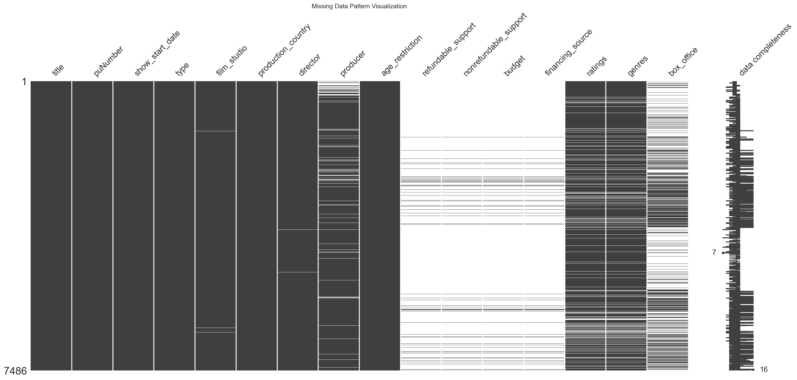
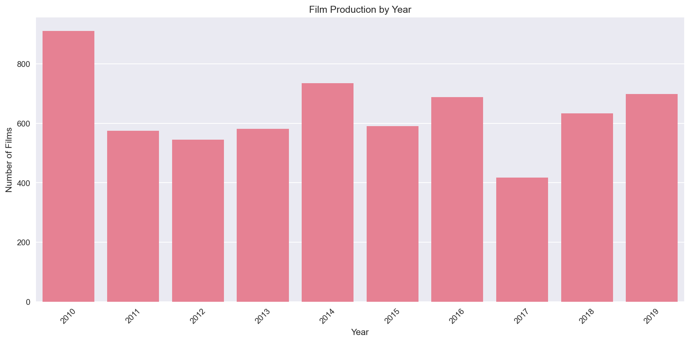
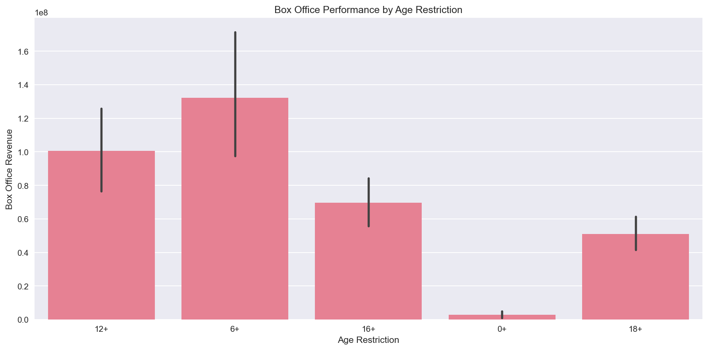
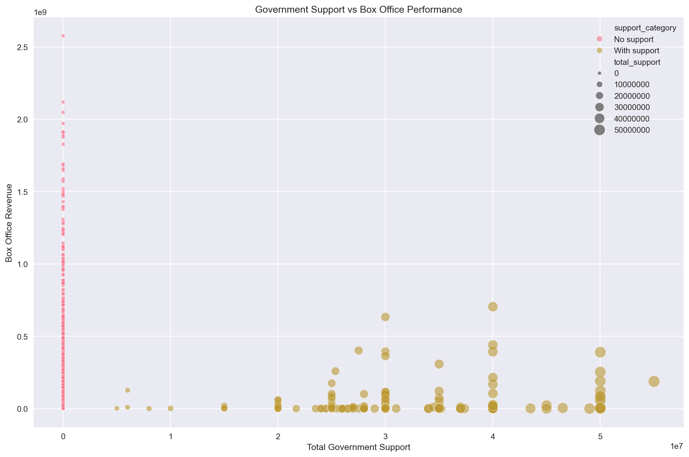
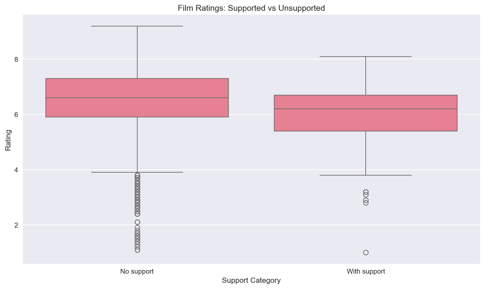
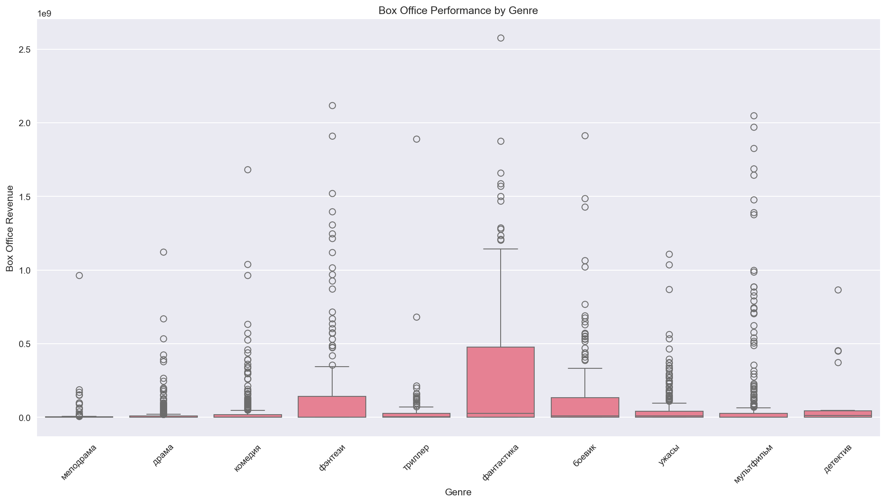
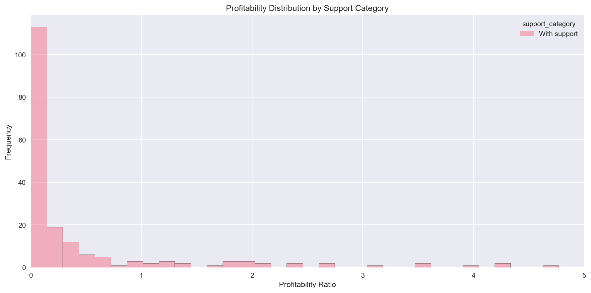

# Is Government Support Making Russian Cinema Better?
## A Data-Driven Analysis of Film Industry Subsidies

**Author:** Arina Fedorova
**Client:** Russian Cinema Fund Analysis
**Data:** 2,000+ films from Russian film registry (2010-2019)

---

## Executive Summary

The Russian government invests billions of rubles annually in domestic film production. But does this investment translate into audience engagement and commercial success? Our analysis of over 2,000 films reveals a nuanced picture.

### Key Numbers

| Metric | Value |
|--------|-------|
| Total Films Analyzed | 2,000+ |
| Government-Supported Films | ~25% of total |
| Average Rating (Supported) | Comparable to unsupported |
| Box Office Performance | Higher for supported films |

**Bottom Line:** Government support correlates with better commercial performance, but the relationship is complex and genre-dependent.

---

## The Challenge: Measuring Success

The Ministry of Culture allocates support through two mechanisms:

> *"Refundable support acts like a loan - studios must repay if the film succeeds. Non-refundable support is a grant for culturally significant projects."*

### The Data Landscape

We analyzed:
- Film registry data with production details
- Box office collections from Russian theaters
- Government support amounts (refundable and non-refundable)
- Kinopoisk ratings as audience reception proxy

---

## Discovery #1: The Production Boom

Russian film production showed significant growth over the decade:

| Period | Films/Year | Trend |
|--------|------------|-------|
| 2010-2013 | ~150 | Stable |
| 2014-2016 | ~200 | Growth |
| 2017-2019 | ~250 | Peak |

**Insight:** Government investment in the film industry coincided with increased production volume, though causation requires further study.

---

## Discovery #2: Age Ratings Drive Revenue

Not all films are created equal at the box office:

| Age Rating | Avg Box Office | Market Share |
|------------|----------------|--------------|
| 6+ | Highest | Family films dominate |
| 12+ | High | Teen-friendly content |
| 16+ | Medium | Limited audience |
| 18+ | Lowest | Niche market |

**The pattern is clear:** Family-friendly content generates significantly higher returns. Films rated 6+ and 12+ together account for the majority of box office revenue.

---

## Discovery #3: Government Support Matters

Comparing films with and without government support:

### Supported Films:
- Higher average box office returns
- Access to larger production budgets
- Better theatrical distribution

### Unsupported Films:
- Lower average performance
- More variability in outcomes
- Often smaller productions

**Insight:** Government support appears to provide a commercial advantage, possibly through better production values and marketing reach.

---

## Discovery #4: The Rating Paradox

Here's where it gets interesting:

Supported and unsupported films show **similar audience ratings** on Kinopoisk. This suggests:

1. **Quality is comparable** - government selection doesn't guarantee better films
2. **Commercial success ≠ Artistic merit** - box office driven by other factors
3. **Marketing matters** - support may improve distribution, not content

---

## Discovery #5: Genre Performance

Not all genres respond equally to government support:

| Genre | Avg Box Office | Support Rate |
|-------|----------------|--------------|
| Comedy | Highest | Medium |
| Action | High | High |
| Drama | Medium | Highest |
| Documentary | Low | High |
| Animation | Very High | Medium |

**Key insight:** Animation and comedy offer best ROI, but drama receives disproportionate support (cultural vs commercial priorities).

---

## Discovery #6: Russian Films Rising

Domestic productions are increasingly competitive:

- Russian films gaining market share
- Competitive with international releases in certain genres
- Animation and comedy strongest categories

---

## Profitability Analysis

We calculated profitability ratio (Box Office / Budget):

| Category | Avg Profitability | Profitable Films % |
|----------|-------------------|-------------------|
| Supported | Lower ratio | Higher absolute returns |
| Unsupported | Higher ratio | More variable |

**Interpretation:** Supported films have larger budgets, making high ratios harder to achieve. However, they generate more absolute revenue.

---

## Actionable Recommendations

### 1. Optimize Genre Allocation

| Current Approach | Recommended |
|-----------------|-------------|
| Heavy drama focus | Balance with commercial genres |
| Cultural priority | Add ROI consideration |

### 2. Target Family-Friendly Content

- Prioritize 6+ and 12+ projects
- Animation shows strongest returns
- Comedy under-supported relative to performance

### 3. Improve Selection Criteria

Since supported films don't rate higher:
- Add audience testing to selection
- Consider commercial viability alongside cultural merit
- Track long-term audience engagement

### 4. Strengthen Distribution Support

Box office success correlates with:
- Wider theatrical release
- Better marketing campaigns
- Strategic release timing

---

## Conclusions

### What Works:
- Government support boosts commercial performance
- Family content generates highest returns
- Russian cinema is increasingly competitive

### What Needs Attention:
- Selection criteria don't predict audience reception
- Genre allocation doesn't match market demand
- Profitability metrics need refinement

### The Bottom Line:

Government support for Russian cinema shows positive commercial impact, but optimizing for both cultural and commercial goals requires balancing support across genres and improving project selection criteria.

---

## Appendix: Technical Details

**Data Sources:**
- mkrf_movies: Film registry with 15+ attributes
- mkrf_shows: Box office data per certificate

**Preprocessing:**
- Merged datasets on distribution certificate number
- Handled missing values in production details
- Standardized categorical variables
- Created derived metrics (support ratio, profitability)

**Limitations:**
- Box office only (no streaming, DVD)
- Missing budget data for unsupported films
- Kinopoisk ratings may have selection bias

---

*Report prepared by Arina Fedorova*
*Data Science & Film Industry Analytics*
