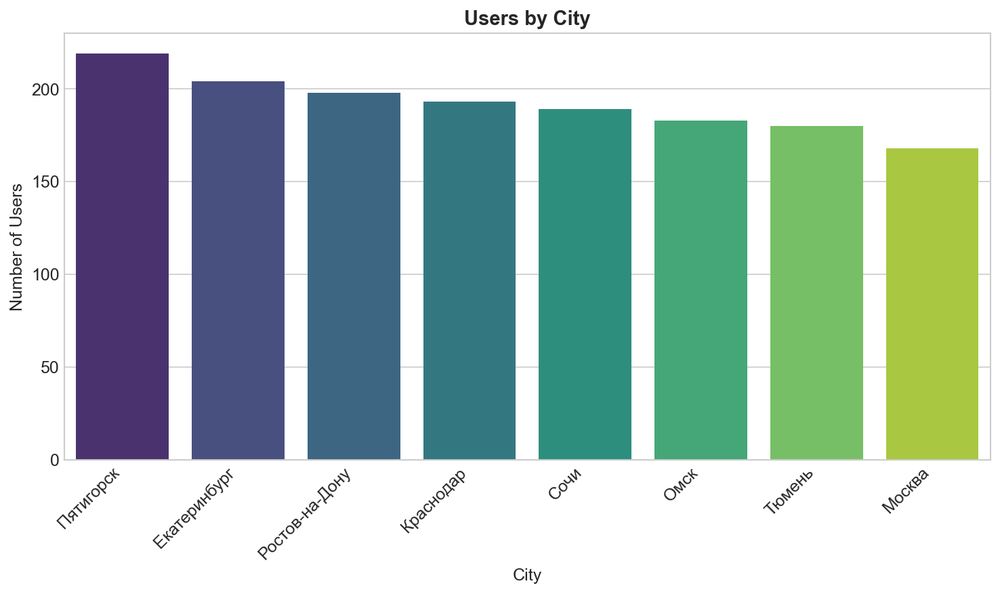
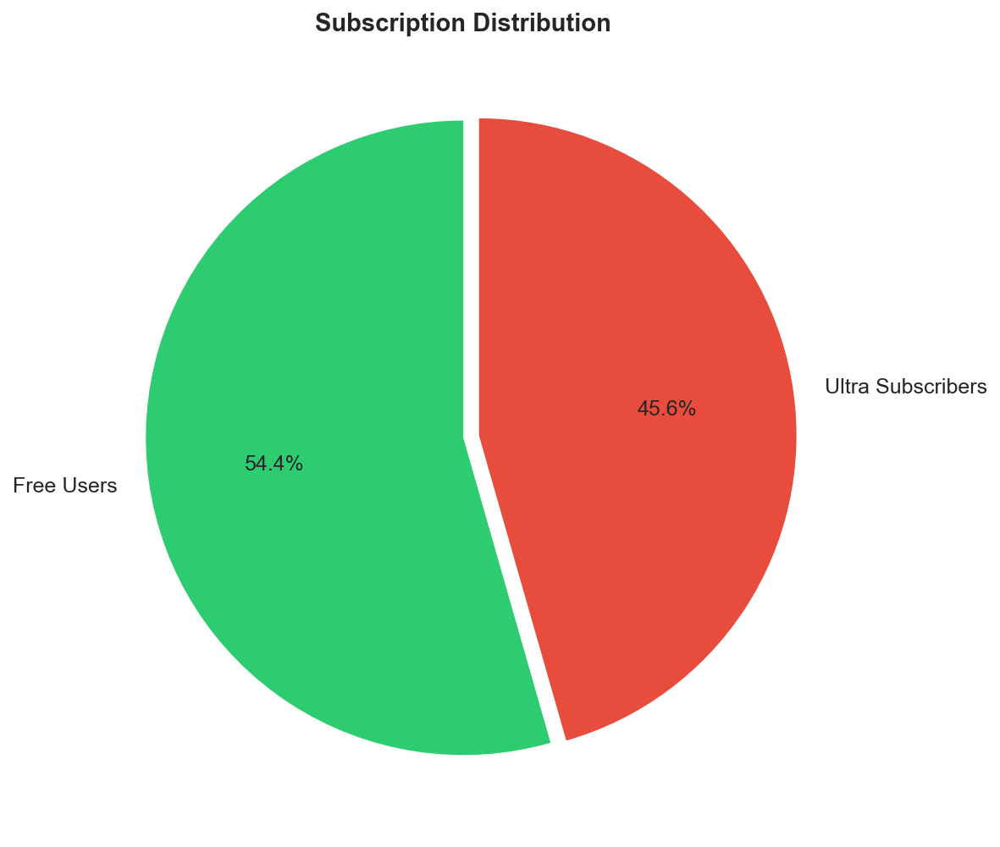
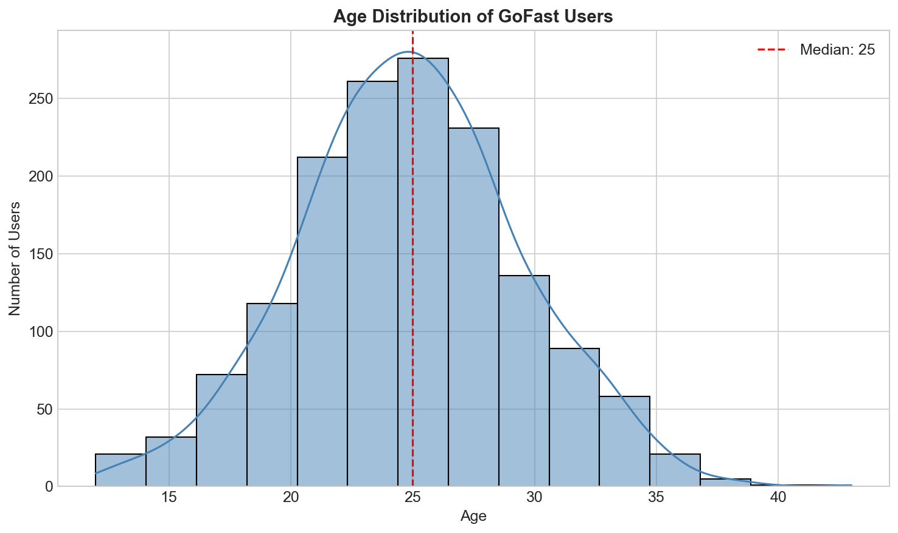
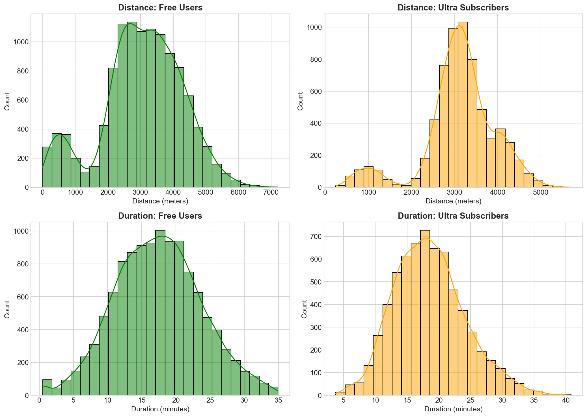
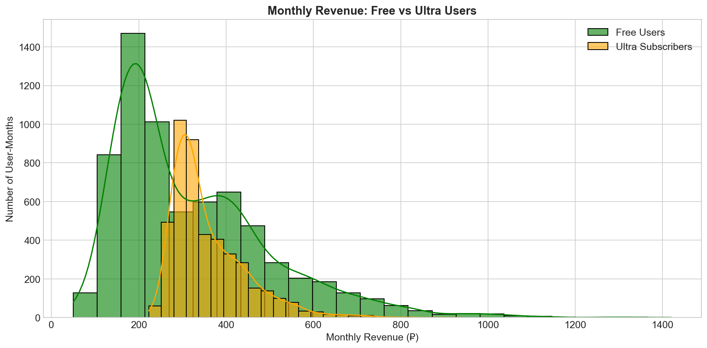
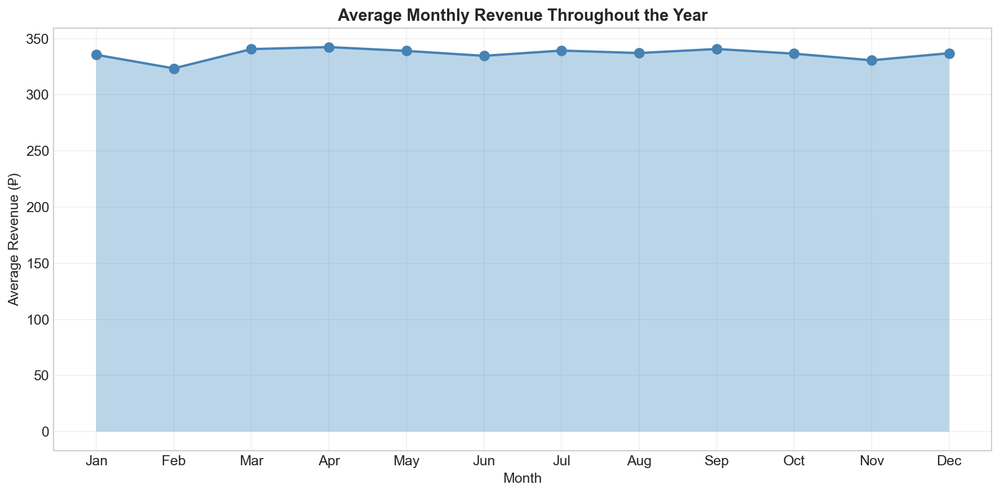

# GoFast Scooter Service: What the Data Reveals About Revenue
## Business Intelligence Report

**Author:** Arina Fedorova
**Data Source:** GoFast Operations (2021)
**Analysis:** 1,534 users, 18,068 rides

---

## Executive Summary

GoFast asked a simple question: should we push harder on subscription conversions? After analyzing a year of ride data, the answer is an emphatic yes.

Ultra subscribers generate twice the monthly revenue of free users (~400₽ vs ~200₽). They ride longer, use the service more consistently, and provide predictable recurring income. With 54% of users still on the free tier, there's significant upside in conversion campaigns.

### Key Numbers
- **Subscriber Revenue Premium**: 2x higher than free users
- **Current Subscription Rate**: 46%
- **Peak Season**: April (spring warmth drives adoption)
- **Core Demographic**: 20-30 year olds (80% of users)

---

## Who Uses GoFast?

### Geographic Distribution

*Figure 1: User distribution reveals surprising geographic patterns*

Here's a puzzle: Pyatigorsk (population 150,000) has more GoFast users than Moscow (population 12 million). Why?

The likely answer is competition and market fit. In smaller cities, GoFast may be the primary micro-mobility option. In Moscow, users have choices — other scooter apps, bike sharing, metro, taxis.

**Business implication:** Moscow represents a growth opportunity, but requires understanding why adoption lags. Is it awareness? Scooter density? Pricing?

### The Subscription Split

*Figure 2: Nearly half of users are already paying subscribers*

46% of users pay 199₽/month for Ultra subscriptions. That's impressive for a subscription service — but it also means 54% are pay-per-ride users who could potentially convert.

### Who's Riding?

*Figure 3: Young urban professionals dominate the user base*

The typical GoFast rider is 25 years old. The 20-30 age bracket accounts for roughly 80% of users. These are digital natives who:
- Expect app-based services
- Value convenience over cost
- Care about sustainability
- Often don't own cars

---

## How Do Subscribers Behave Differently?

*Figure 4: Subscribers show more consistent, longer usage patterns*

The data reveals a clear pattern:
- **Subscribers** prefer medium-distance trips (2.5-4 km) and ride longer per session
- **Free users** show more variation — occasional users with diverse needs

Why do subscribers ride longer? Simple economics. With no start fee (50₽ saved per ride) and lower per-minute rates (6₽ vs 8₽), they don't feel the meter ticking. They can take scenic routes, make stops, ride at leisure.

---

## The Revenue Picture

### Who's More Valuable?

*Figure 5: Subscribers generate significantly higher monthly revenue*

Despite paying lower per-minute rates, subscribers generate roughly double the monthly revenue:
- **Ultra subscribers**: ~400₽/month average
- **Free users**: ~200₽/month average

How is this possible? Volume and consistency. Subscribers ride more often and longer per session. The subscription fee provides baseline revenue, and usage adds on top.

**The long tail is interesting.** Notice the free users generating 500-700₽/month? These are power users who should be targeted for conversion — they'd save money on a subscription while increasing GoFast's revenue predictability.

### Seasonal Patterns

*Figure 6: Clear seasonal patterns in revenue*

Revenue follows predictable seasonal patterns:
- **February dip**: Cold weather, short month
- **April peak**: Spring warmth drives scooter adoption
- **Summer decline**: Vacation season, urban exodus
- **September recovery**: Back to school/work
- **December bump**: Holiday shopping, urban mobility

**Marketing timing matters.** Spring campaigns (March-April) catch the wave of renewed interest. Fall campaigns (September) capture returning users.

---

## Statistical Validation

We tested three business-critical hypotheses:

| Hypothesis | Test | Result |
|------------|------|--------|
| Subscribers spend more time riding | t-test | **Confirmed** (p < 0.001) |
| Subscriber distance exceeds 3130m | t-test | Not confirmed (p = 0.92) |
| Subscribers generate more revenue | t-test | **Confirmed** (p < 0.001) |

The statistical evidence is clear: subscribers are behaviorally and financially distinct from free users, and they're more valuable to the business.

---

## Marketing Calculations

### How Many Promo Codes for 100 Renewals?

If trial-to-subscription conversion is 10%, and we need 100 renewals with 95% confidence:

**Answer: Send 1,161 promo codes**

The math (binomial distribution) accounts for the uncertainty in who will actually convert. With a 10% base rate, we need roughly 12x our target to hit it reliably.

### Push Notification Performance

For a campaign of 1 million notifications with 40% open rate:

**P(fewer than 399,500 opens) = 15.4%**

In 85% of campaigns, you'll exceed 399,500 opens. Plan accordingly.

---

## Recommendations

### Immediate Actions

| Priority | Action | Expected Impact |
|----------|--------|-----------------|
| High | Target high-spend free users for conversion | Increase subscriber base by 10-15% |
| High | Spring marketing push (March-April) | Capture seasonal demand surge |
| Medium | Investigate Moscow underperformance | Unlock largest market potential |

### Conversion Campaign Strategy

1. **Identify targets**: Free users spending >300₽/month (they'd save with subscription)
2. **Messaging**: Emphasize no start fees, longer rides, lower per-minute cost
3. **Timing**: Launch in late February to catch spring adoption wave
4. **Offer**: First month free trial, automatic conversion unless canceled

### Geographic Expansion

Study why Pyatigorsk succeeds:
- Lower competition?
- Better scooter density?
- Tourist-friendly pricing?

Apply learnings to Moscow and other major cities where penetration is lower than expected.

---

## Technical Notes

- **Data Period**: January - December 2021
- **Statistical Tests**: Welch's t-test (unequal variances assumed)
- **Significance Level**: α = 0.05
- **Revenue Calculation**: subscription_fee + (duration × minute_price) + (rides × start_fee)

---

*Arina Fedorova*
