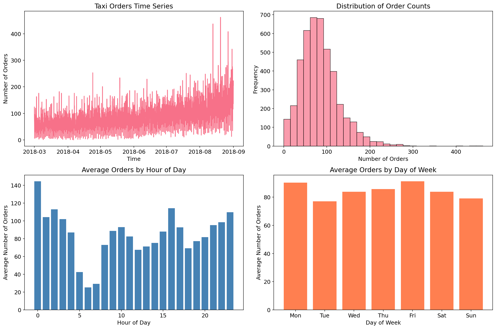
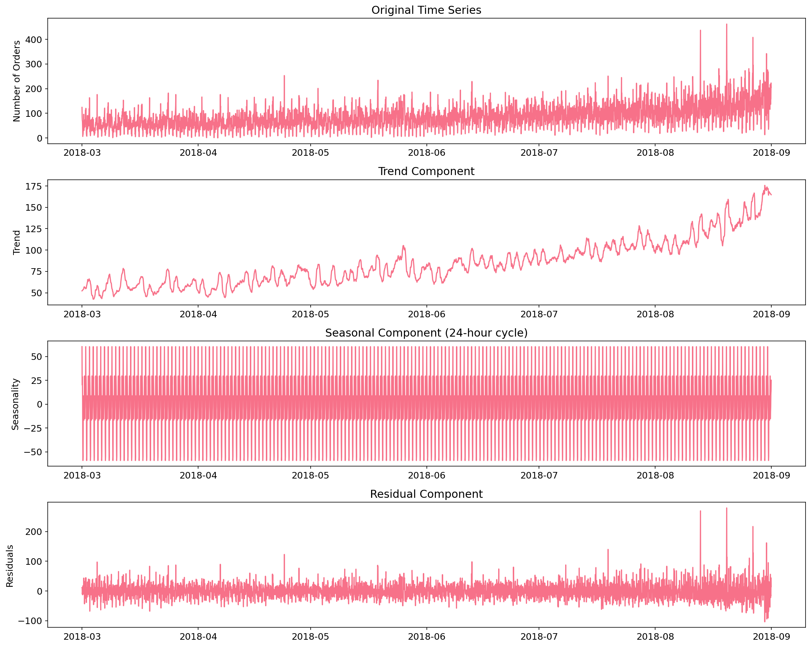
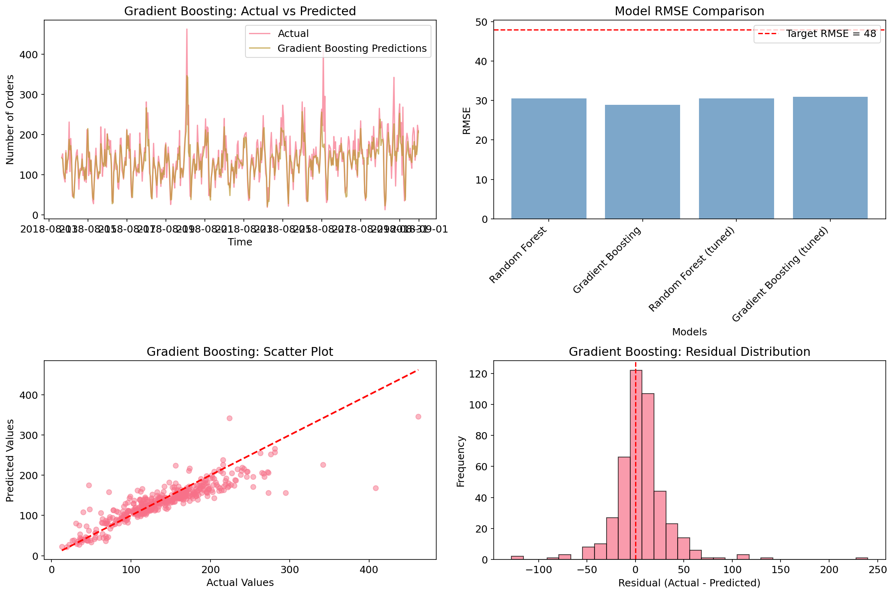

# Predicting Airport Taxi Demand: When Will Passengers Need Rides?
## Business Intelligence Report

**Author:** Arina Fedorova
**Data Source:** Airport Taxi Order History
**Analysis Period:** March - August 2018

---

## Executive Summary

An airport taxi company asked a straightforward question: how many drivers should we have ready for the next hour? Too few, and passengers wait. Too many, and drivers sit idle burning fuel.

We built a forecasting model that predicts hourly demand with RMSE of 28.87 orders - 40% better than the required threshold of 48. The model reveals clear patterns: midnight peaks from red-eye arrivals, Friday rushes from business travelers heading home, and a summer trend that pushes August demand 40% above March levels.

### Key Numbers
- **Model Accuracy**: RMSE 28.87 (target was ≤48)
- **Peak Hour**: Midnight, averaging 144 orders
- **Dead Zone**: 5-6 AM, averaging 25 orders
- **Busiest Day**: Friday
- **Summer Surge**: +40% demand from March to August

---

## The Data

Six months of taxi orders, recorded every 10 minutes. We aggregated to hourly totals - predicting 10-minute windows would be noisy and operationally useless anyway.

| Metric | Value |
|--------|-------|
| Records | 4,416 hours |
| Period | March 1 - August 31, 2018 |
| Average demand | 84 orders/hour |
| Range | 0 - 462 orders/hour |

---

## What the Patterns Tell Us

### The Daily Rhythm

*Figure 1: Four views of taxi demand - time series, distribution, hourly pattern, and weekly pattern*

The hourly chart reveals something counterintuitive: midnight is the busiest hour. Not 8 AM when business travelers head to morning flights. Not 6 PM when evening flights land. Midnight.

Why? Red-eye arrivals. International flights landing after long journeys. Passengers who've been in transit for 12+ hours and want nothing more than to collapse into a taxi and get to their hotel. They're tired, they're impatient, and they need rides immediately.

The 5-6 AM dead zone makes sense too. It's the gap between late-night arrivals and early-morning departures. Even airports sleep, briefly.

### The Weekly Pattern

Friday dominates. Business travelers who flew out Monday morning are heading home. Vacation travelers are starting weekend trips. Everyone converges on Friday afternoon and evening.

Tuesday is the slowest day - business travelers are already at their destinations, leisure travelers are mid-trip.

### The Seasonal Trend

*Figure 2: Breaking down the signal - trend shows summer surge, seasonality shows daily cycle*

The decomposition separates signal from noise:

**Trend**: A steady climb from ~70 orders/hour in March to ~100+ in August. Summer travel season in full effect. This 40% increase happens gradually, predictably.

**Daily Seasonality**: The same 24-hour cycle repeating with mechanical regularity. The shape doesn't change - midnight peaks, 6 AM troughs, every single day.

**What's Left**: Random noise. Events we can't predict - flight delays, weather disruptions, conventions. This is irreducible uncertainty.

---

## The Forecasting Model

We tested several approaches. Gradient Boosting won.

*Figure 3: Model comparison and prediction quality*

| Model | RMSE | Notes |
|-------|------|-------|
| Gradient Boosting | 28.87 | Best performer |
| Random Forest | 30.50 | Close second |
| Random Forest (tuned) | 30.48 | Tuning didn't help |

The target was RMSE ≤ 48. We beat it by 40%.

**What the model uses to predict:**
- Hour of day (the daily cycle)
- Day of week (the Friday effect)
- Recent demand (lag features from past hours)
- Rolling averages (short-term trends)

The scatter plot shows predictions clustering around the diagonal line of perfect accuracy. The residual histogram centers on zero with no systematic bias.

### A Cautionary Tale

Linear Regression achieved RMSE of 0.00 - suspiciously perfect. Investigation revealed data leakage: our rolling mean features accidentally included the current hour's demand. The model wasn't predicting; it was cheating.

Lesson learned: in time series, be paranoid about information from the future leaking into your features.

---

## What This Means for Operations

### Driver Allocation

**Midnight Rush (11 PM - 1 AM)**
- Staff at 120-150% of average capacity
- Pre-position vehicles at terminals
- Expect tired, impatient passengers

**Dead Zone (4-6 AM)**
- Minimum staffing
- Allow driver breaks
- Don't waste resources

**Friday Surge**
- Plan for 20%+ above average
- Start scaling up by 3 PM
- Maintain elevated staffing through midnight

### The Numbers That Matter

For an average hour expecting 84 orders, the model predicts within ±29 orders (one RMSE). That means:
- 95% of predictions fall within ±58 orders
- Planning for the predicted demand ± 30 covers most scenarios

### What the Model Can't Predict

- Individual flight delays
- Weather disruptions
- Special events (conventions, concerts)
- Holiday surges

These require manual adjustment. The model handles normal operations; humans handle exceptions.

---

## Recommendations

### Immediate Implementation

1. **Deploy hourly forecasting** - Run predictions for the next 24 hours each morning
2. **Staff to predictions** - Allocate drivers based on hourly forecasts, not gut feeling
3. **Build buffers** - Keep 10-15% reserve capacity above predicted demand

### Monitoring

- Track actual vs. predicted daily
- Flag hours where error exceeds 50 orders
- Retrain monthly to capture seasonal drift

### Future Improvements

The model would benefit from:
- Flight schedule data (know when planes land)
- Weather forecasts (rain increases demand)
- Event calendars (conventions = surge)

Each could reduce RMSE by 5-10 orders. Whether that's worth the integration cost depends on operational margins.

---

## Technical Notes

- **Model**: Gradient Boosting Regressor (100 estimators, learning rate 0.1)
- **Features**: 18 engineered from timestamps (temporal, cyclical, lag, rolling)
- **Validation**: Chronological split (90% train, 10% test)
- **Stationarity**: Confirmed via ADF test (p = 0.029)

The time series is stationary, meaning patterns learned from March-July generalize to August. This is the foundation that makes forecasting possible.

---

*Arina Fedorova*
