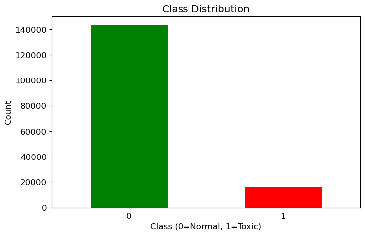
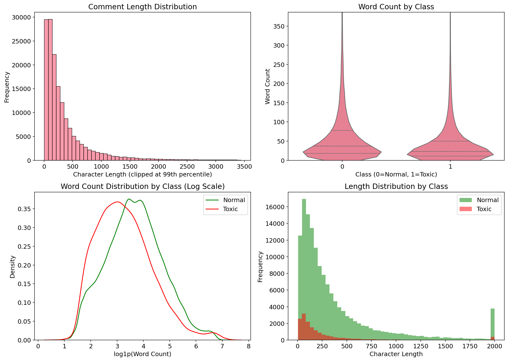
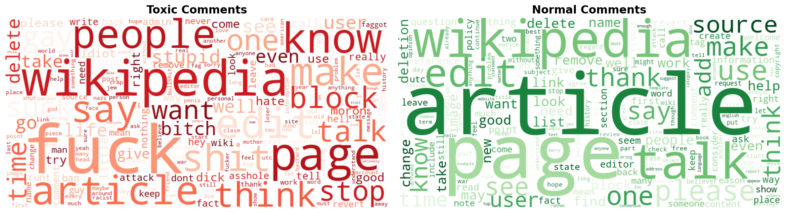
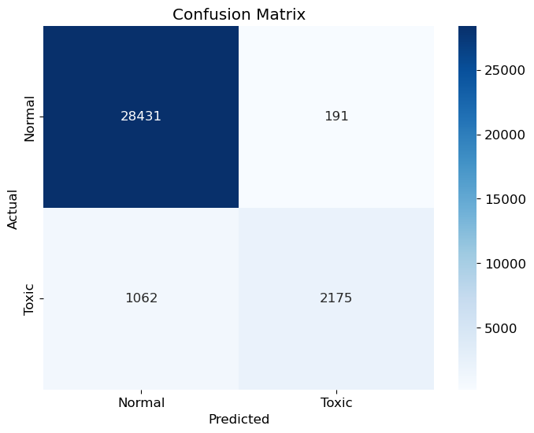
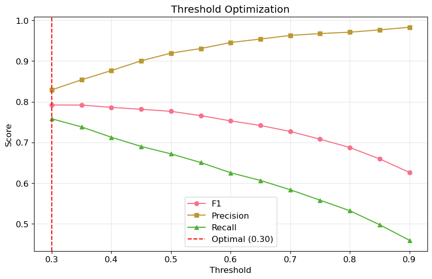

# Catching Toxic Comments Before They Poison the Discussion
## Business Intelligence Report

**Author:** Arina Fedorova
**Data Source:** E-commerce Platform Comments
**Analysis:** 159,292 user comments

---

## Executive Summary

An e-commerce platform asked us to build an automated filter for toxic comments. Manual moderation couldn't keep up with volume, and toxic content was damaging community trust.

We built a classifier that catches 67% of toxic comments with 92% precision - meaning when it flags something, it's almost always right. The model can be tuned to catch more (76% at lower precision), depending on moderation capacity.

### Key Numbers
- **F1 Score**: 0.78 (target was ≥0.75)
- **Precision**: 92% (few false alarms)
- **Recall**: 67% (catches 2/3 of toxic content)
- **Dataset**: 159,292 comments, 10% toxic

---

## The Data Problem

### Class Imbalance

*Figure 1: Only 10% of comments are toxic - significant class imbalance*

The first thing we noticed: toxic comments are rare. Only 10.16% of the dataset (16,186 out of 159,292) was labeled toxic. This imbalance matters:

- Accuracy is misleading (a model that says "not toxic" every time gets 90% accuracy)
- F1 score is the right metric - it balances precision and recall
- The model must learn from limited toxic examples

### Text Length Doesn't Help

*Figure 2: Toxic and normal comments have similar length distributions*

We hoped toxic comments might be shorter (angry outbursts) or longer (sustained attacks). They're not. Both classes show nearly identical length distributions.

This means we can't take shortcuts. The model must understand content, not just count characters.

---

## What Makes a Comment Toxic

### The Visual Difference

*Figure 3: Word clouds reveal stark lexical differences between toxic (left) and normal (right) comments*

The word clouds tell the story immediately. Toxic comments are dominated by profanity, slurs, and insults - words that jump out even at a glance. Normal comments show collaborative vocabulary: "article," "page," "edit," "please," "thanks."

This visual separation is why the model works. The two classes live in different linguistic worlds.

The model learned to recognize toxic patterns through TF-IDF features - words and phrases weighted by how distinctive they are.

**Strongest toxic indicators:**
| Word | Weight |
|------|--------|
| fuck | 21.3 |
| fucking | 19.2 |
| shit | 17.2 |
| idiot | 16.5 |
| stupid | 14.7 |

**Strongest normal indicators:**
| Word | Weight |
|------|--------|
| talk | -3.6 |
| best | -3.5 |
| thanks | -3.3 |
| thank you | -3.0 |
| help | -2.4 |

No surprises here. Explicit profanity and insults signal toxicity. Polite, constructive language signals normal discussion. The model captures what humans intuitively know.

---

## Model Performance

We tested three approaches:

| Model | F1 Score |
|-------|----------|
| Logistic Regression | 0.758 |
| Random Forest | 0.738 |
| Naive Bayes | 0.693 |

Logistic Regression won - simple, fast, interpretable. After tuning (C=2.0), final performance:

*Figure 4: Model predictions vs actual labels*

**Breaking down the confusion matrix:**
- **28,431 True Negatives**: Normal comments correctly approved
- **191 False Positives**: Normal comments incorrectly flagged (0.7% of normal)
- **2,175 True Positives**: Toxic comments correctly caught
- **1,062 False Negatives**: Toxic comments that slipped through (33% of toxic)

The model is conservative - it rarely flags innocent comments, but it misses about a third of toxic content.

---

## The Threshold Trade-off

*Figure 5: Precision vs Recall at different classification thresholds*

The default threshold (0.5) maximizes precision at 92%. But we can adjust:

| Threshold | Precision | Recall | F1 |
|-----------|-----------|--------|-----|
| 0.50 | 92% | 67% | 0.78 |
| 0.30 | 83% | 76% | 0.79 |

**At threshold 0.30:**
- Catch 76% of toxic comments (vs 67%)
- But 17% of flags are false alarms (vs 8%)

The right choice depends on moderation capacity. More moderators? Lower threshold. Overwhelmed team? Keep it at 0.5.

---

## What This Means for the Platform

### Two Operating Modes

**High Precision Mode (threshold 0.5)**
- Use when: Moderation team is small
- Result: Fewer false alarms, but 33% of toxic comments get through
- User impact: Some toxic content visible before manual review catches it

**Balanced Mode (threshold 0.3)**
- Use when: Moderation capacity exists
- Result: Catches 76% of toxic, but more false alarms
- User impact: Cleaner discussions, but some frustrated users wrongly flagged

### What the Model Can't Do

1. **Context-dependent toxicity**: "You're killing it!" is praise, not a threat
2. **Sarcasm**: "Oh great, another brilliant idea" reads as positive
3. **New slang**: Novel insults won't be caught until retraining
4. **Non-English content**: Model is English-only

These gaps require human moderators. The model is a first filter, not a replacement.

---

## Recommendations

### Immediate Deployment

1. **Start with threshold 0.5** - minimize disruption from false positives
2. **Route flagged comments to human review** - don't auto-delete
3. **Track false positive complaints** - users will tell you when they're wrongly flagged

### Ongoing Improvement

1. **Collect moderator feedback** - which flags were wrong?
2. **Retrain quarterly** - language evolves
3. **Monitor recall** - are toxic comments still getting through?

### Future Development

1. **Severity levels** - distinguish "mildly rude" from "hate speech"
2. **User history** - repeat offenders vs first-time mistakes
3. **BERT upgrade** - deep learning for context understanding

---

## Technical Notes

- **Model**: Logistic Regression (C=2.0)
- **Features**: TF-IDF with 10,000 vocabulary, 1-2 ngrams
- **Preprocessing**: POS-aware lemmatization, negation preservation
- **Data Filtering**: Comments ≤2000 chars (removes spam/repetitive content)
- **Training**: ~125,000 comments (after filtering)
- **Validation**: 20% holdout, stratified
- **Inference**: ~10ms per comment

---

*Arina Fedorova*
